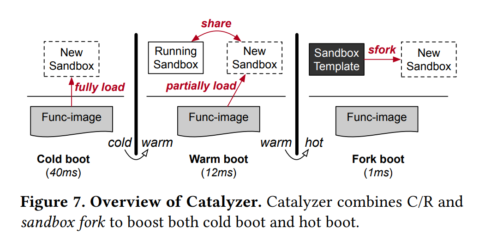

# Catalyzer

- [Catalyzer | Proceedings of the Twenty-Fifth International Conference on Architectural Support for Programming Languages and Operating Systems (acm.org)](https://dl.acm.org/doi/10.1145/3373376.3378512)

- [Catalyzer: Sub-millisecond Startup for Serverless Computing with Initialization-less Booting (sjtu.edu.cn)](https://ipads.se.sjtu.edu.cn/zh/publications/DuASPLOS20.pdf)

不从头初始化沙盒，通过restore 沙盒镜像的 checkpoint来跳过初始化

提出了 sfork (sandbox fork)

通过restore 沙盒镜像的 checkpoint 来跳过初始化，并且只按需恢复 serverless 函数所使用的用户态和内核态的一部分（内存的数据，和系统状态（文件描述符或句柄））。

基于 Google gVisor 实现。

**gVisor** 是谷歌开发的一个容器沙箱，专注于安全性、效率和易用性。gVisor 在用户空间中实现了大约 200 个 Linux 系统调用，与直接在 Linux 内核之上运行并与命名空间隔离的 Docker 容器相比，具有更高的安全性。

- [google/gvisor: Application Kernel for Containers (github.com)](https://github.com/google/gvisor)

It includes an [Open Container Initiative (OCI)](https://www.opencontainers.org/) runtime called `runsc` that provides an isolation boundary between the application and the host kernel. The `runsc` runtime integrates with Docker and Kubernetes, making it simple to run sandboxed containers.

**Catalyzer**

三种启动方式:

- cold boot

  通过restore预先经过完整备份的函数镜像的checkpoint来创建函数实例。

- warm boot

  系统中已经存在被调函数的运行实例，Catalyzer通过在新创实例与现有实例之间共享内存状态，来加速启动过程。

- fork boot

  引入了一种新的操作系统原语sfork （sandbox fork），通过直接复用给定的沙箱模板来快速启动新实例，其中，沙箱模板保存了函数初始化完成后的内存状态。

主要优化点：按需恢复，复制模板或实例 (sfork)