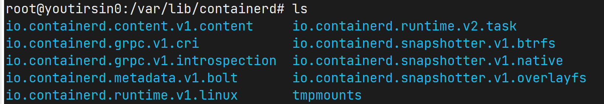
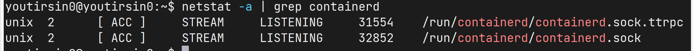
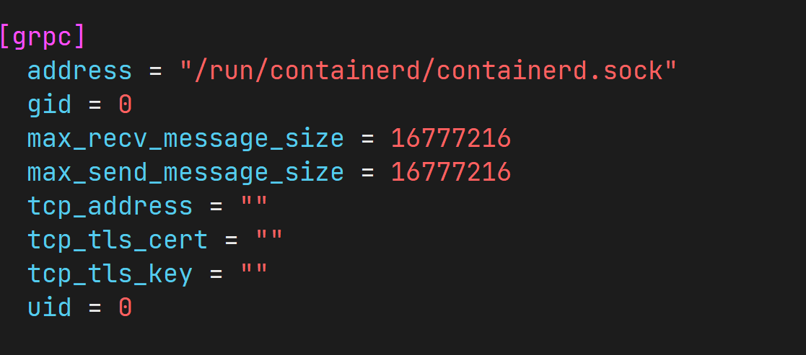
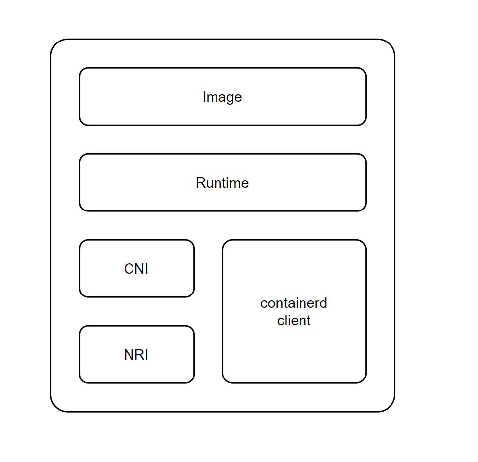
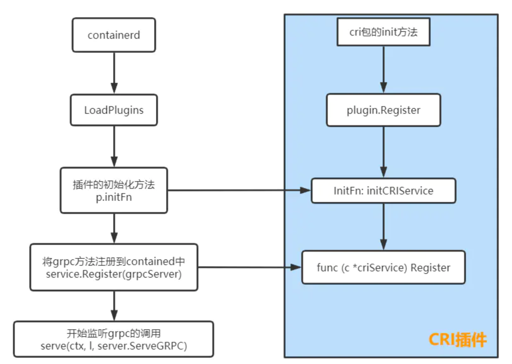
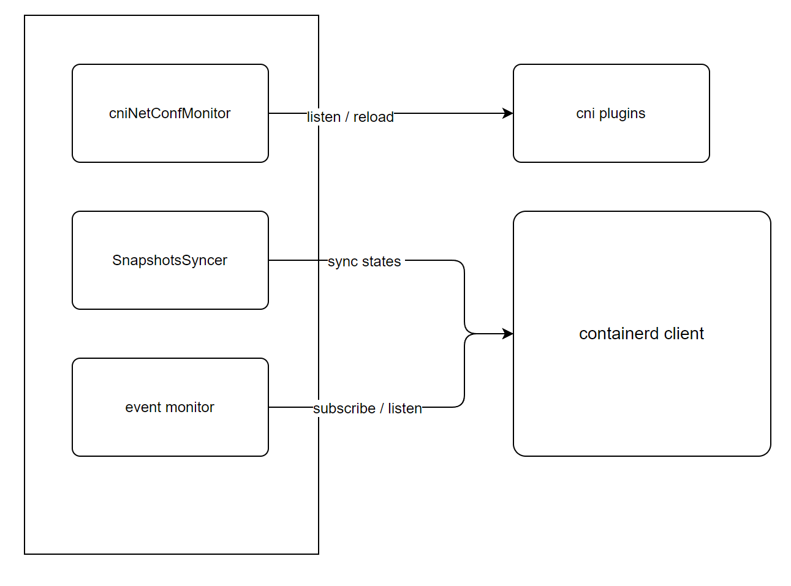

# containerd

**brief**

- containerd initialization
- cri plugin

## containerd

```go
// Server is the containerd main daemon
type Server struct {
	grpcServer  *grpc.Server
	ttrpcServer *ttrpc.Server
	tcpServer   *grpc.Server
	config      *srvconfig.Config
	plugins     []*plugin.Plugin
}

// New creates and initializes a new containerd server
func New(ctx context.Context, config *srvconfig.Config) (*Server, error)
```

1. 初始化 containerd server

   1. 加载插件信息，依照插件依赖关系，对初始化顺序进行排序

      

   2. 初始化 TTRPC server, GRPC server 和 TCP server

      

      

      TCP server 与 GRPC server 配置相同，只多了 TLS 安全加密。tcp server 默认不开启

      ```go
      tcpServerOpts := serverOpts
      if config.GRPC.TCPTLSCert != "" {
          log.G(ctx).Info("setting up tls on tcp GRPC services...")
      
          tlsCert, err := tls.LoadX509KeyPair(config.GRPC.TCPTLSCert, config.GRPC.TCPTLSKey)
          if err != nil {
              return nil, err
          }
          tlsConfig := &tls.Config{Certificates: []tls.Certificate{tlsCert}}
      
          if config.GRPC.TCPTLSCA != "" {
              caCertPool := x509.NewCertPool()
              caCert, err := os.ReadFile(config.GRPC.TCPTLSCA)
              if err != nil {
                  return nil, fmt.Errorf("failed to load CA file: %w", err)
              }
              caCertPool.AppendCertsFromPEM(caCert)
              tlsConfig.ClientCAs = caCertPool
              tlsConfig.ClientAuth = tls.RequireAndVerifyClientCert
          }
      
          tcpServerOpts = append(tcpServerOpts, grpc.Creds(credentials.NewTLS(tlsConfig)))
      }
      ...
      grpcServer = grpc.NewServer(serverOpts...)
      tcpServer  = grpc.NewServer(tcpServerOpts...)
      ```

   3. 加载插件配置并初始化插件，加载插件所需注册的服务

   4. 注册所有 TTRPC, GRPC, TCP 服务

2. 配置服务路径，包括 Metrics, TTRPC, TCP, GRPC 服务路径

## CRI 插件





```go
// Register CRI service plugin
func init() {
	config := criconfig.DefaultConfig()
	plugin.Register(&plugin.Registration{
		Type:   plugin.GRPCPlugin,
		ID:     "cri",
		Config: &config,
		Requires: []plugin.Type{
			plugin.EventPlugin,
			plugin.ServicePlugin,
			plugin.NRIApiPlugin,
		},
		InitFn: initCRIService,
	})
}
```

1. 加载插件配置

2. 初始化 containerd 客户端，连接 containerd

3. 初始化 CRIService

### CRIService 初始化

```go
// pkg/cri/server/server.go
// CRIService is the interface implement CRI remote service server.
type CRIService interface {
	runtime.RuntimeServiceServer
	runtime.ImageServiceServer
	// Closer is used by containerd to gracefully stop cri service.
	io.Closer

	Run() error

	Register(*grpc.Server) error
}

// pkg/cri/server/service.go
// criService implements CRIService.
type criService struct {
    ...
}

// NewCRIService returns a new instance of CRIService
func NewCRIService(config criconfig.Config, client *containerd.Client, nri *nri.API) (CRIService, error)
```

1. 加载 containerd 的 SnapshotService 和镜像文件系统路径，默认为 `overlayfs`
2. 初始化系统设置
3. 初始化 streaming server (用于 `Exec/attach/port-forward` streaming 请求)

4. 初始化 event monitor，用于监听 containerd 事件
5. SnapshotsSyncer
6. 初始化 cniNetConfMonitor，用于监听 CNI 网络插件配置变化并重新加载插件
7. 初始化 NRI (Node Resource Interface) ，用于通过 NRI 直接和容器打交道



### event monitor

使用 containerd client 监听 containerd 发出的容器和镜像事件并进行处理，将信息更新到xxxStore缓存。

```
filters := []string{
    `topic=="/tasks/oom"`,
    `topic~="/images/"`,
}

# 事件类型:
TaskExit
TaskOOM
ImageCreate
ImageUpdate
ImageDelete
```

### cniNetConfMonitor

监听网络配置文件，依据变动重新加载网络插件

```go
c.cniNetConfMonitor = make(map[string]*cniNetConfSyncer)
```

针对每个插件开启一个 cniNetConfSyncer，负责监听 cni 网络配置文件变动，并重新加载插件

```go
// cniNetConfSyncer is used to reload cni network conf triggered by fs change
// events.
type cniNetConfSyncer struct {
	// only used for lastSyncStatus
	sync.RWMutex
	lastSyncStatus error

	watcher   *fsnotify.Watcher
	confDir   string
	netPlugin cni.CNI
	loadOpts  []cni.Opt
}

// syncLoop monitors any fs change events from cni conf dir and tries to reload
// cni configuration.
func (syncer *cniNetConfSyncer) syncLoop() error
```

### SnapshotsSyncer

用于定期同步 containerd 的 Snapshotter 信息并进行缓存

```go
// snapshotsSyncer syncs snapshot stats periodically. imagefs info and container stats
// should both use cached result here.
// TODO(random-liu): Benchmark with high workload. We may need a statsSyncer instead if
// benchmark result shows that container cpu/memory stats also need to be cached.
type snapshotsSyncer struct {
	store       *snapshotstore.Store
	snapshotter snapshot.Snapshotter
	syncPeriod  time.Duration
}

// sync updates all snapshots stats.
func (s *snapshotsSyncer) sync() error
```

### CRI Server 的实现 (注册服务实现)

```go
func (c *criService) register(s *grpc.Server) error {
	instrumented := instrument.NewService(c)
	runtime.RegisterRuntimeServiceServer(s, instrumented)
	runtime.RegisterImageServiceServer(s, instrumented)

	instrumentedAlpha := instrument.NewAlphaService(c)
	runtime_alpha.RegisterRuntimeServiceServer(s, instrumentedAlpha)
	runtime_alpha.RegisterImageServiceServer(s, instrumentedAlpha)

	return nil
}

// GRPCServices are all the grpc services provided by cri containerd.
type GRPCServices interface {
	runtime.RuntimeServiceServer
	runtime.ImageServiceServer
}
```

具体服务的实现

- /pkg/cri/server/*
