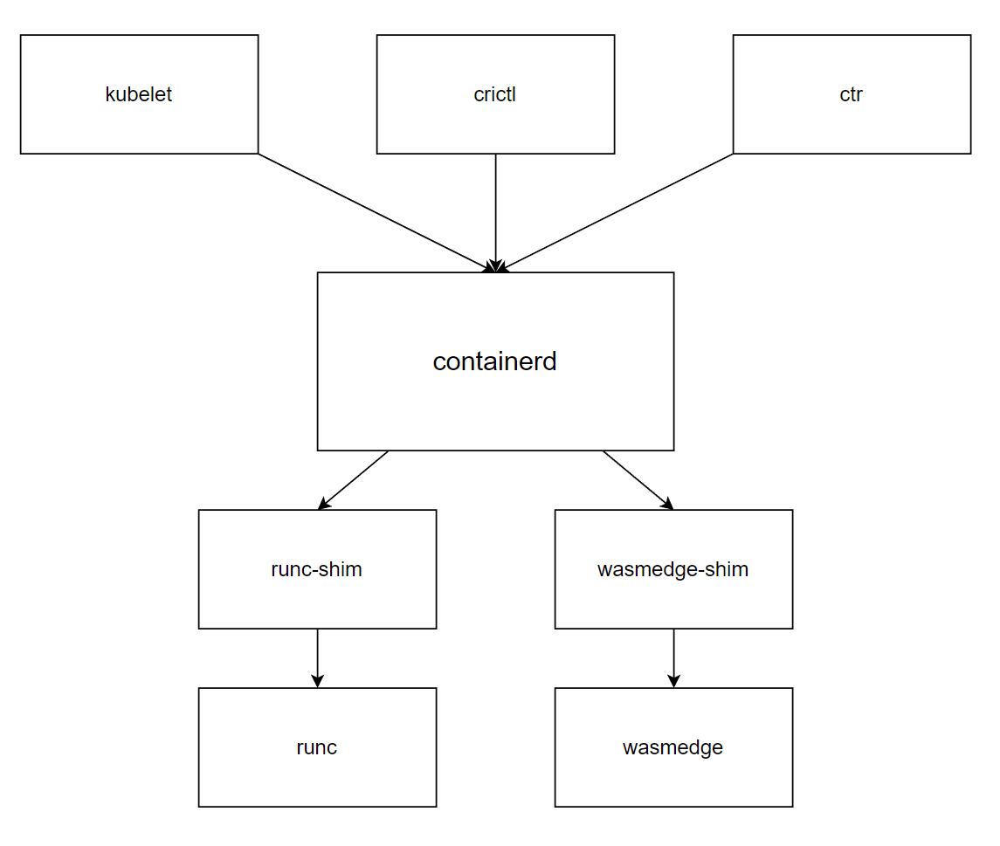

# using containerd with wasmedge-shim



## installation

### installation of containerd

- [containerd/getting-started.md at main · containerd/containerd (github.com)](https://github.com/containerd/containerd/blob/main/docs/getting-started.md)

推荐使用官方 Release 解压安装，不要从 apt 之类的安装，能保证最新版的 containerd，与 k8s 兼容。

1. install containerd
2. run containerd as a service with systemd
3. install runc
4. install cni-plugins

### install wasmedge

- [Installation And Uninstallation - WasmEdge Runtime](https://wasmedge.org/book/en/quick_start/install.html)

```bash
curl -sSf https://raw.githubusercontent.com/WasmEdge/WasmEdge/master/utils/install.sh | bash

# source somthing to activate as instructed
```

### install wasmedge-shim

- [containerd/runwasi: Facilitates running Wasm / WASI workloads managed by containerd (github.com)](https://github.com/containerd/runwasi)

```bash
git clone https://github.com/containerd/runwasi.git
```

runwasi 提供实现 containerd 的 wasm shim 框架，同时提供了一个示例的 wasmedge shim 和 wasmtime shim。

使用 rust 编译。安装 rust。

- [Install Rust - Rust Programming Language (rust-lang.org)](https://www.rust-lang.org/tools/install)
- [Other Installation Methods - Rust Forge (rust-lang.org)](https://forge.rust-lang.org/infra/other-installation-methods.html)

installation on Unix.

```bash
curl https://sh.rustup.rs -sSf | sh
```

编译安装 wasmedge shim

```bash
# unit test
cargo test -- --nocapture

# install shims to /usr/local/bin, where containerd and other shims are there.
make build
sudo make install

# load wasi-demo-app.wasm into oci.tar. and import as a local image with ctr
make load
```

## 测试

### 使用 ctr 对 containerd 进行测试

```bash
sudo ctr run --rm \
--runtime=io.containerd.wasmedge.v1 ghcr.io/containerd/runwasi/wasi-demo-app:latest \
testwasm \
/wasi-demo-app.wasm echo 'hello'
# output:
# 	hello
#	exiting
```

### 使用 k8s 进行测试

**1. 准备**

为 containerd 配置 runtime

```toml
[plugins."io.containerd.grpc.v1.cri".containerd.runtimes]

# -------------------- add -------------------------------
    [plugins."io.containerd.grpc.v1.cri".containerd.runtimes.wasmedge]
      	runtime_type = "io.containerd.wasmedge.v1"
# --------------------------------------------------------

    [plugins."io.containerd.grpc.v1.cri".containerd.runtimes.runc]
      	base_runtime_spec = ""
      	container_annotations = []
      	pod_annotations = []
      	privileged_without_host_devices = false
      	runtime_engine = ""
      	runtime_root = ""
      	runtime_type = "io.containerd.runc.v2"
```

使用 K8s 创建 RuntimeClass，创建 Deployment。

```yaml
apiVersion: node.k8s.io/v1
kind: RuntimeClass
metadata:
  name: wasmedge
handler: wasmedge
---
apiVersion: apps/v1
kind: Deployment
metadata:
  name: wasi-demo
  labels:
    app: wasi-demo
spec:
  replicas: 1
  selector:
    matchLabels:
      app: wasi-demo
  template:
    metadata:
      labels:
        app: wasi-demo
    spec:
      runtimeClassName: wasmedge
      containers:
      - name: demo
        image: ghcr.io/containerd/runwasi/wasi-demo-app:latest
        imagePullPolicy: Never
```

由于指定了`imagePullPolicy: Never`不从远端拉取镜像，containerd 会从本地使用上述加载的本地镜像。

查看工作节点的 containerd 看到 wasm shim 正常启动，wasm 容器正常运行。

### 使用 crictl 进行测试

