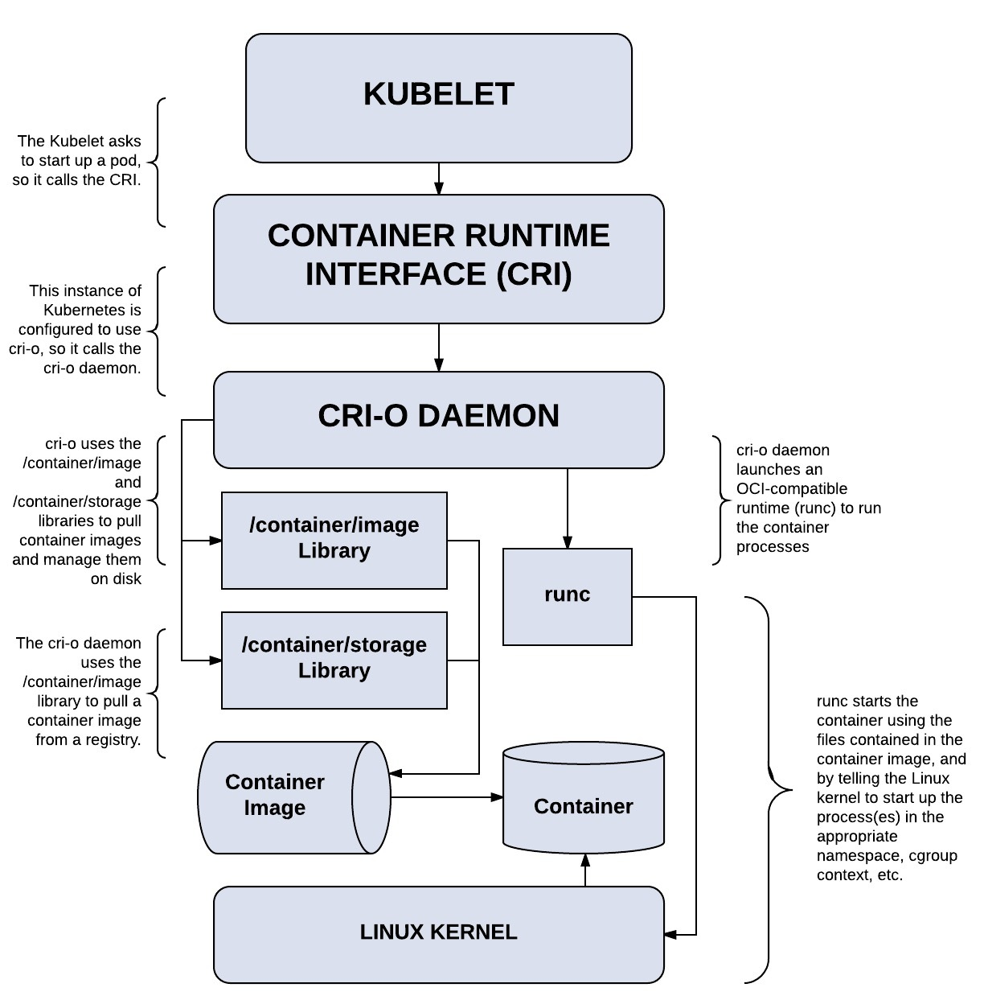
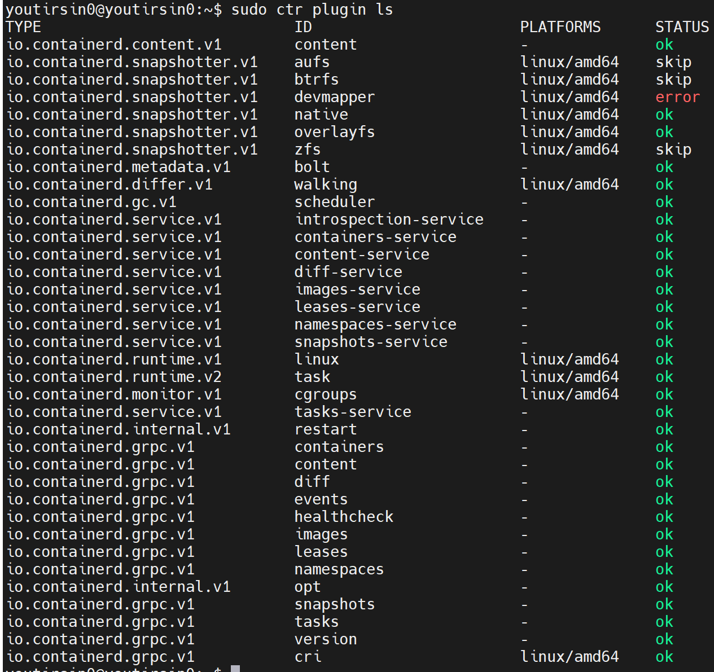
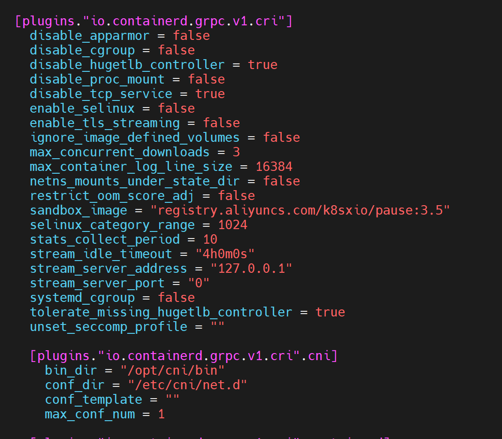
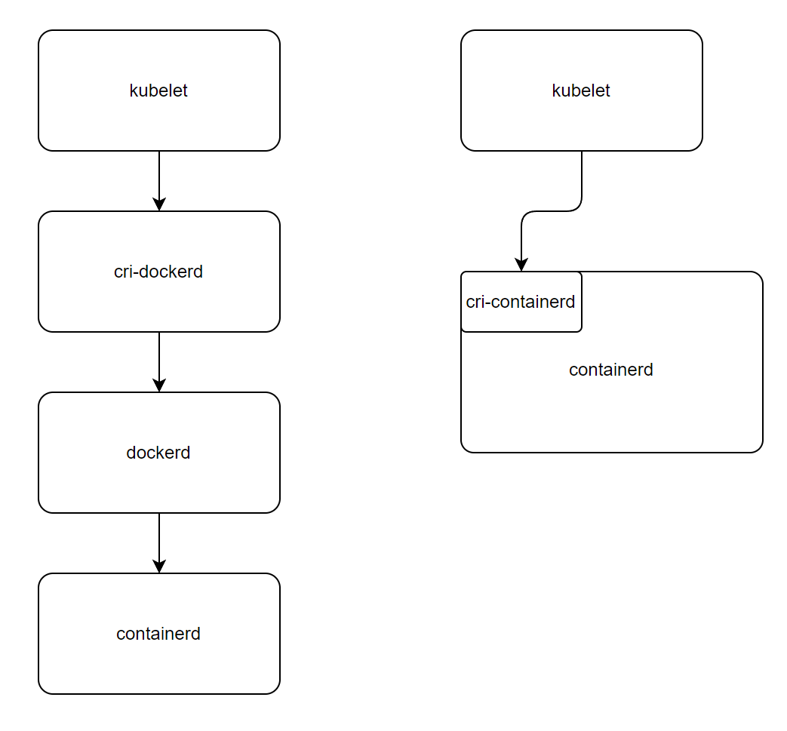
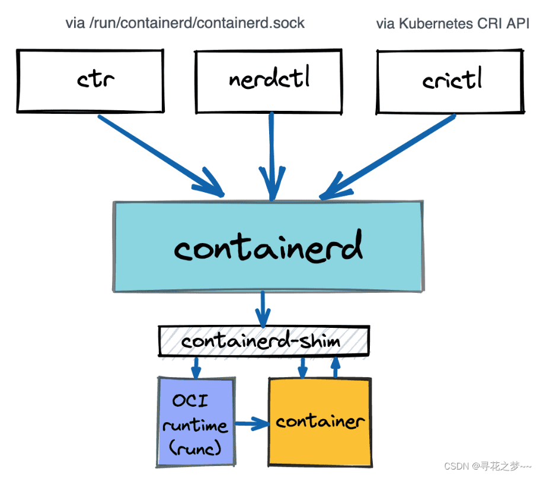

## cri-o

- [轻量级容器运行时 CRI-O](https://blog.csdn.net/ccy19910925/article/details/118386726)
- [cri-o](https://cri-o.io/)

**cri-o 组件**

- [OCI compatible runtime](https://github.com/opencontainers/runtime-tools)

  支持所有 OCI 标准的运行时。经测试的有 runc 和 clear containers ( 现移植为 kata-containers )

  - OCI 运行时容器标准 [runtime-spec/spec.md at main · opencontainers/runtime-spec (github.com)](https://github.com/opencontainers/runtime-spec/blob/main/spec.md)

- [containers/storage](https://github.com/containers/storage)

  负责镜像的存储和容器根文件系统的创建等。支持`Overlayfs`, `devicemapper`, `AUFS` 和`btrfs`。默认为`Overlayfs`

- [containers/image](https://github.com/containers/image)

  负责镜像的拉取和管理。

- [networking (CNI)](https://github.com/containernetworking/cni)

  Container Network Interface，是 K8s 中标准的一个调用网络实现的接口。Kubelet 通过这个标准的 API 来调用不同的网络插件以实现不同的网络配置方式。实现了这个接口的就是 CNI 插件。CNI 的使用采取配置文件和二进制插件的方式。

- [container monitoring (conmon)](https://github.com/containers/conmon)

  OCI 容器监控程序，介于容器管理（如CRI-O）和 OCI 运行时（runc, crun）之间，以单独进程的方式用于监听单个容器。启用容器时，它将 OCI 运行时作为它的子进程，方便管理。

  当容器运行时，它会使用 socket 将容器的标准输入输出流重定向至 socket 并获取，将内容日志进行存储和管理。

  CRI-O 使用 conmon 对容器进行监控，日志处理，以及对客户端进行服务和 OOM 事件进行监控。

  

**cri-o调用流程**

1. Kubernetes 通知 kubelet 启动一个 pod。
   - Pods are a kubernetes concept consisting of one or more containers sharing the same IPC, NET and PID namespaces and living in the same cgroup.

2. kubelet 通过 CRI(Container runtime interface) 将请求转发给 **CRI-O daemon**。

3. CRI-O 利用 **containers/image** 库从镜像仓库拉取镜像。

4. 下载好的镜像被解压到容器的根文件系统中，并通过 **containers/storage** 库存储到 COW 文件系统中。

5. 在为容器创建 rootfs 之后，CRI-O 通过 **oci-runtime-tool** 生成一个 OCI runtime specification  json 文件，描述如何使用 OCI Generate tools 运行容器。
   - [opencontainers/runtime-tools: OCI Runtime Tools (github.com)](https://github.com/opencontainers/runtime-tools)

6. 然后 CRI-O 使用 OCI runtime specification 启动一个兼容 CRI 的运行时来运行容器进程。默认的运行时是 **runc**。

7. 每个容器都由一个独立的 **conmon** 进程监控。它还负责处理容器的日志记录并记录容器进程的退出代码。

8. 网络是通过 **CNI** 接口设置的，所以任何 CNI 插件都可以与 CRI-O 一起使用。

**slices**

- 最小化的 CRI SHIM
- 最大化复用现有组件和库

- 容器符合 OCI 规范
  - [runtime-spec/spec.md at main · opencontainers/runtime-spec (github.com)](https://github.com/opencontainers/runtime-spec/blob/main/spec.md)

- 镜像拉取符合规范
  - [Image Manifest V 2, Schema 1 | Docker Documentation](https://docs.docker.com/registry/spec/manifest-v2-1/)

比较紧凑， CRI 与 OCI 定制向，拓展意义不大。

## cri-containerd

- [containerd/architecture.md at main · containerd/containerd (github.com)](https://github.com/containerd/containerd/blob/main/docs/cri/architecture.md)
- [Talk about containerd](https://www.jianshu.com/p/edc572533518)

**pod 创建过程**

- kubelet 通过 cri runtime service 接口调用 cri 插件创建 pod
- cri 通过 cni 创建和配置 pod 的网络
- cri 调用 containerd 创建并运行一个特殊的 pause 容器，将其放至 pod 的 cgroups 和 namespace
- kubelet 随后通过 cri image service 接口调用 cri 插件来拉取镜像
- cri 随后使用 containerd 来拉取不在节点上的镜像
- kubelet 再通过 cri runtime service 接口调用 cri 使用所拉取镜像在 pod 内创建并运行容器。
- 最后 cri 使用 containerd 创建 应用容器，并放至 pod 的 cgroups 和 namespace 内。

**kubelet 通过 cri 调用 containerd 启动容器过程**

1. kubelet 通过 cri 请求 cri-containerd 进行服务。

2. cri-containerd 将容器请求转发给 containerd，containerd使用 Images 组件来检查本地是否已经存在所需的容器镜像。

3. 如果本地不存在镜像，则Images组件将从镜像仓库下载所需的镜像，并将其保存到本地。在这个过程中，Content 组件将会被用来管理容器镜像的文件系统内容。

4. 如果需要，Snapshot组件将创建一个容器快照（Snapshot），并将其作为容器的文件系统根目录。这可以帮助保证容器的隔离性和快速启动。

5. Runtime 组件创建一个新的容器进程，并为该进程设置所需的容器资源（如Cgroups和Namespace等）。

6. Runtime 组件使用 Content 组件加载镜像文件系统和容器元数据。这将确保容器具有正确的文件系统，以及运行容器所需的其他元数据。

7. Runtime 组件启动容器进程，并使用 grpc 接口向上层容器运行时返回响应，表明容器已经成功创建。

**containerd 插件系统**

containerd以插件的方式来保证其内部实现的低耦合性，稳定性。containerd用等同的方式看待内部以及外部插件。

**containerd 内置插件**

**插件配置**

通过在containerd配置文件中添加`[plugins]`段来对内置插件进行配置

对于特定插件可以通过`[plugins.id]`进行独立配置

可以借助其插件系统和组件化设计进行拓展，对CRI-plugin 进行改造来进行容器类型的选择，并为 WebAssembly 实现所需的 service 等组件。

可以借用 containerd 整体的架构设计，拓展新的组件，改造必要组件。配置方式，组件的插件注册和管理等都可以直接使用。

## cri-dockerd

单独的二进制程序，用于将 cri 请求转为对 dockerd 的请求。不作考虑。

## crictl

- [cri-tools/crictl.md at master · kubernetes-sigs/cri-tools (github.com)](https://github.com/kubernetes-sigs/cri-tools/blob/master/docs/crictl.md)

提供 Cli 工具用于访问 CRI 兼容的容器运行时。

