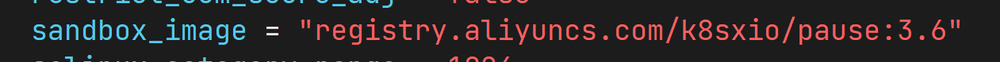
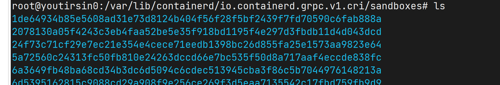
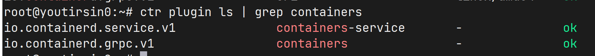
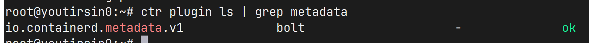
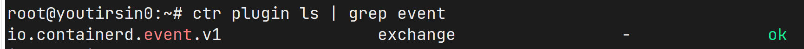
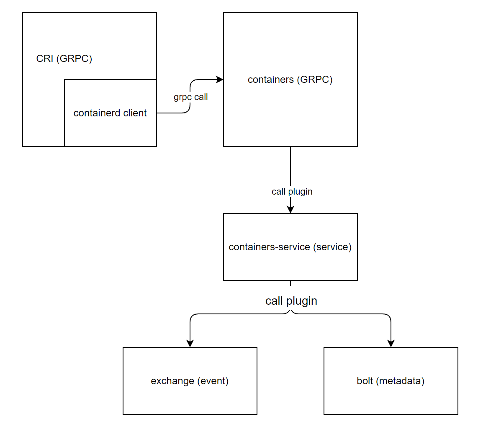
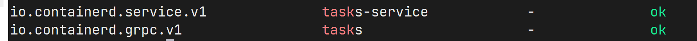
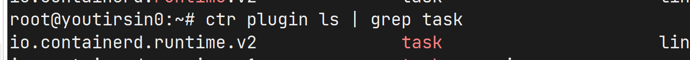
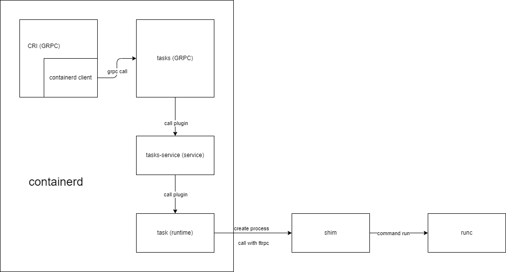

## RunPodSandBox

### 生成 Sandbox

1. 读取请求中的 sandbox 配置
2. 生成唯一 id 和 sandbox 名称，保留名字防止重复请求
3. 生成内部 sandbox 对象 （sandboxStore）

### 生成沙盒镜像



Pause 容器全称 infrastucture container（又叫infra）基础容器。每个Pod里运行着一个特殊的被称之为 Pause 的容器，其他容器则为业务容器，这些业务容器共享Pause容器的网络栈和Volume挂载卷，因此他们之间通信和数据交换更为高效。Pause 容器主要提供以下功能：

- PID命名空间：Pod中的不同应用程序可以看到其他应用程序的进程ID
- 网络命名空间：Pod中的多个容器能够访问同一个IP和端口范围
- IPC命名空间：Pod中的多个容器能够使用SystemV IPC或POSIX消息队列进行通信
- UTS命名空间：Pod中的多个容器共享一个主机名；Volumes（共享存储卷）：
- Pod中的各个容器可以访问在Pod级别定义的Volume

1. 确保Sandbox镜像存在，不存在的话则pull拉取 (ensureImageExist)

2. 读取配置文件和请求中的 runtime handler 信息，获取运行 sandbox 容器的运行时

   ```go
   type RunPodSandboxRequest struct {
   	// Configuration for creating a PodSandbox.
   	Config *PodSandboxConfig `protobuf:"bytes,1,opt,name=config,proto3" json:"config,omitempty"`
   	// Named runtime configuration to use for this PodSandbox.
   	// If the runtime handler is unknown, this request should be rejected.  An
   	// empty string should select the default handler, equivalent to the
   	// behavior before this feature was added.
   	// See https://git.k8s.io/enhancements/keps/sig-node/585-runtime-class
   	RuntimeHandler       string   `protobuf:"bytes,2,opt,name=runtime_handler,json=runtimeHandler,proto3" json:"runtime_handler,omitempty"`
   	XXX_NoUnkeyedLiteral struct{} `json:"-"`
   	XXX_sizecache        int32    `json:"-"`
   }
   ```

   如果 handler 存在在配置文件则选用，不存在则拒绝处理

   如果为空，则使用默认运行时

   

3. 创建容器对象（containerSpec）

4. 调用 containerd client 创建容器

   ```go
   client.NewContainer
   ```

### 准备运行环境并生成和执行 task

1. 创建沙盒容器根目录 (`/var/lib/containerd/io.containerd.grpc.v1.cri/sandboxs/${id}`)

   

2. 初始化沙盒所需文件

   ```go
   // setupSandboxFiles sets up necessary sandbox files including /dev/shm, /etc/hosts,
   // /etc/resolv.conf and /etc/hostname.
   ```

3. 配置网络，创建网络命名空间，调用 cni 插件初始化网络

4. 创建 task 并运行 task 启动沙盒容器

   ```go
   container.NewTask
   task.Start
   ```
   
   *containerd 的 task 是标志一个任务，用于启动容器、管理网络等。创建的容器，并没有处于running状态，只是一个静态的容器，需要使用 task 启动容器。*

## CreateContainer

1. 读取配置，获取容器所属的 sandbox，生成唯一 id 和名称
2. 获取容器镜像（默认调用请求前已拉取，这里不拉取）
3. 创建容器根目录`/var/lib/containerd/io.containerd.grpc.v1.cri/containers/{id}`

4. 读取volume 挂载配置，初始化 volume 挂载

5. 获取 sandbox 的 runtime (和 sandbox 使用相同 OCI runtime)

6. 获取 containerd 的 snapshotter，初始化容器的根文件系统

7. 验证日志路径（日志独立的生命周期）

8. 创建 container io (fifo)（用于日志）

9. 调用 containerd client 创建容器

   ```go
   client.NewContainer
   ```

## StartContainer

1. 从 container store 获取容器信息和 sandbox 信息，设置状态信息，验证容器实际状态

2. 使用管道io，创建 container logger

3. 获取 sandbox 的 runtime (和 sandbox 使用相同 OCI runtime)

4. 创建运行容器的 task 并运行

   ```go
   container.NewTask
   task.Start
   ```

## client.NewContainer

```go
c.client.NewContainer(ctx, id, opts...)

// 调用远端 service
c.ContainerService().Create(ctx, container)

// 创建 rpc 请求
r.client.Create(ctx, &containersapi.CreateContainerRequest{
    Container: containerToProto(&container),
})

// 发送请求
c.cc.Invoke(ctx, "/containerd.services.containers.v1.Containers/Create", in, out, opts...)
```



```go
// 请求处理
func (s *service) Create(ctx context.Context, req *api.CreateContainerRequest) (*api.CreateContainerResponse, error) {
	return s.local.Create(ctx, req)
}
```





```go
// 1. 使用 bolt 插件，将创建的 container 的 metadata 信息保存到 bolt 数据库中
// 2. 使用 exchange 插件发布容器创建事件 "/containers/create"
func (l *local) Create(ctx context.Context, req *api.CreateContainerRequest, _ ...grpc.CallOption)
```

### workflow



## container.NewTask

```go
container.NewTask(ctx, ioCreation, taskOpts...)

// 调用远端服务
c.client.TaskService().Create(ctx, request)

// 发送请求
c.cc.Invoke(ctx, "/containerd.services.tasks.v1.Tasks/Create", in, out, opts...)
```



```go
// 请求处理
func (s *service) Create(ctx context.Context, r *api.CreateTaskRequest) (*api.CreateTaskResponse, error) {
	return s.local.Create(ctx, r)
}
```



```go
// Create launches new shim instance and creates new task
func (m *TaskManager) Create(ctx context.Context, taskID string, opts runtime.CreateOpts)
```

1. 创建 shim 进程

   ```go
   // shimeManager
   m.manager.Start(ctx, taskID, opts)
   ```

   1. 创建 Bundle

   2. 根据 runtime 名称 获取 shim 的可执行程序（如`containerd-shim-runc-v2`）

   3. 创建 shim 进程（脱离 containerd，另起进程，与 containerd 通过 ttrpc 进行交互）

      ```go
      func (b *binary) Start(ctx context.Context, opts *types.Any, onClose func())
      
      client.Command(
      		ctx,
      		&client.CommandConfig{
      			Runtime:      b.runtime,
      			Address:      b.containerdAddress,
      			TTRPCAddress: b.containerdTTRPCAddress,
      			Path:         b.bundle.Path,
      			Opts:         opts,
      			Args:         args,
      			SchedCore:    b.schedCore,
      		})
      ```

2. 向 shim 发起请求创建 shim 的 task

   ```go
   shimTask.Create(ctx, opts)
   // 通过 ttrpc 请求
   s.task.Create(ctx, request)
   
   type taskClient struct {
   	client *ttrpc.Client
   }
   // 发送 ttrpc 请求
   c.client.Call(ctx, "containerd.task.v2.Task", "Create", req, &resp)
   ```

```go
// Create a new initial process and container with the underlying OCI runtime
func (s *service) Create(ctx context.Context, r *taskAPI.CreateTaskRequest) (_ *taskAPI.CreateTaskResponse, err error)

container, err := runc.NewContainer(ctx, s.platform, r)
```

### workflow


