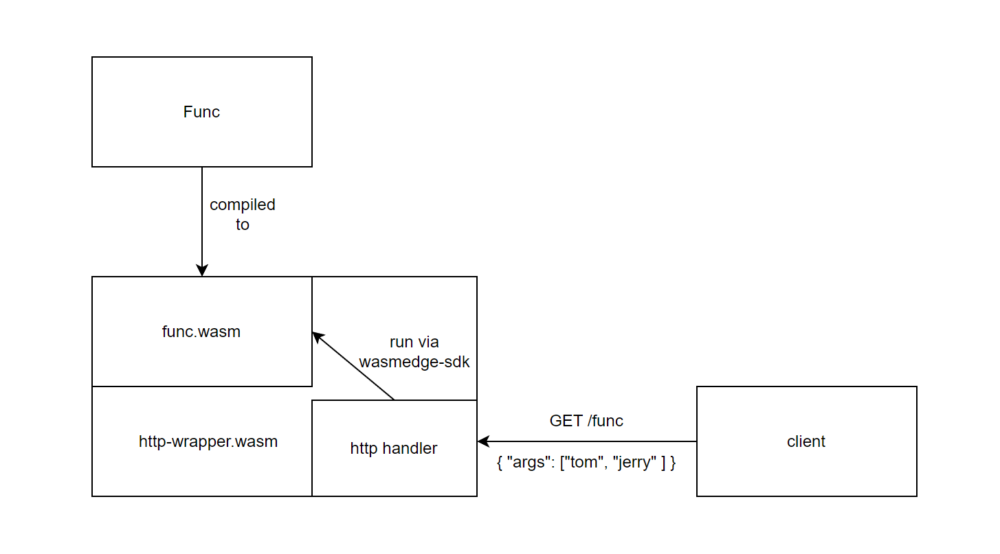
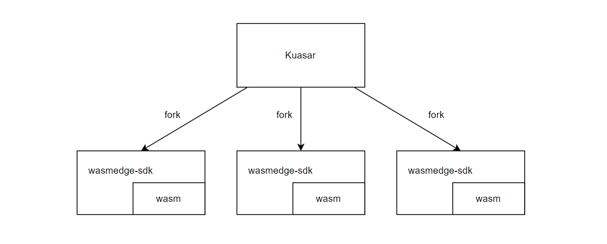
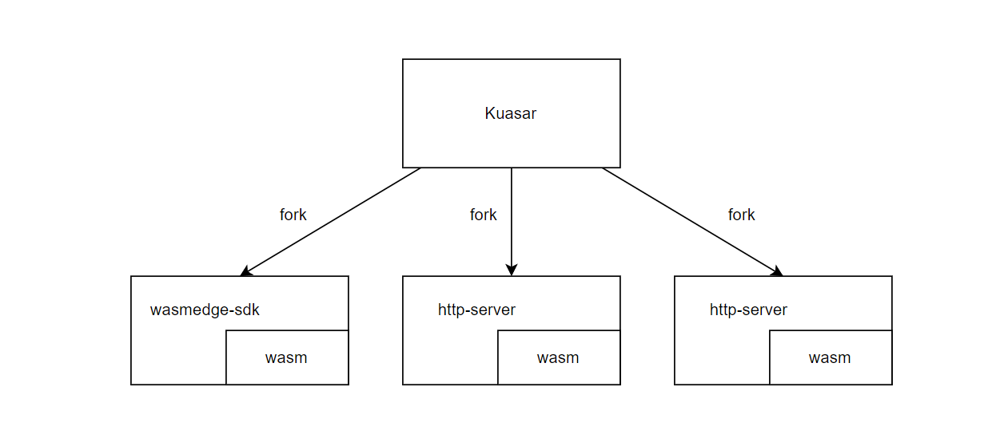
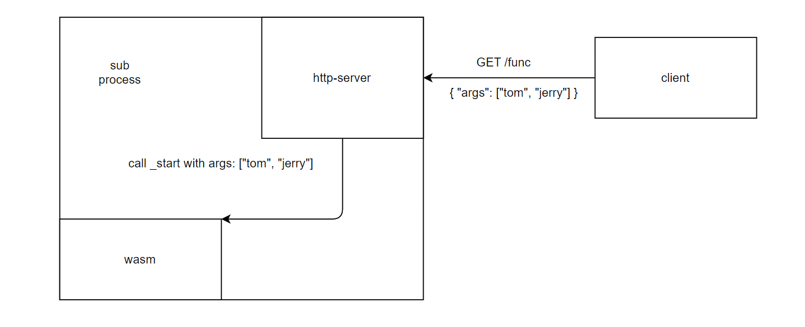
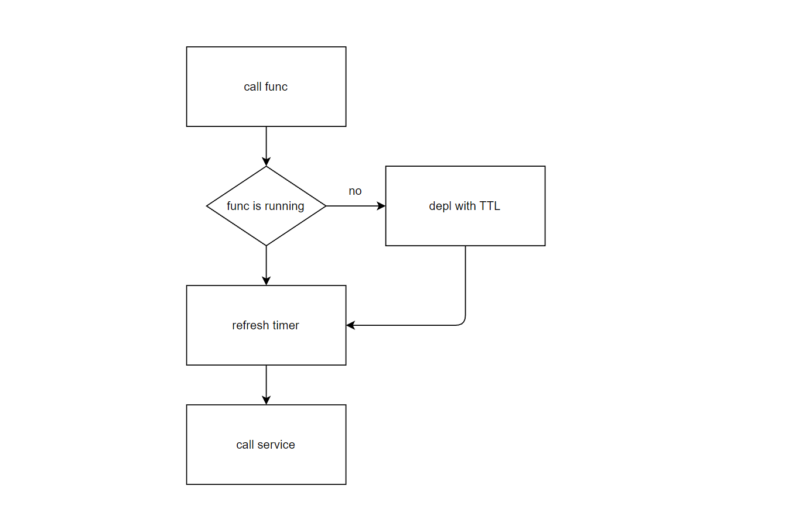

## 需求

1. **短函数的函数性质。**

   短函数不是一个具体化的 Job。而是提供一个短功能，能够处理不同的参数获取结果。

2. **短函数的保活。**

   短函数不像长服务一样常驻，而是执行完后会退出。但希望让其保活一段时间，防止重复创建相同的短函数。每次访问会延长它的 TTL。


## proposals

使用`_start`作为所有短函数 wasm 的入口，避免不同语言编译后函数签名不一致问题。只需确保编写代码能编译成 wasi wasm。

使用 argv 作为统一的 request 参数，执行返回状态码作为统一的 response 返回值。


example func

```c
// compiled to func.wasm
int main(int argc, char **argv) {
    for (size_t t i = 0; i < argc; ++i) {
        printf("%s ", argv[i]);
    }
    return 0;
}
```

## proposal 1

对于上述的示例函数，将其使用 http server 包装，能够通过 get 请求访问。并将 http-wrapper 也打包成 wasm，作为 K8s 的 wasm 工作负载。




**不可行原因**

http-wrapper 使用 wasmedge-sdk ，而 wasmedge-sdk 本身不能完全通过 wasm 编译。

**C / C++**

使用 emcc 编译时，无法链接 libwasmedge.so，因为 emcc 必须链接由 emcc 编译的库。

- [Dynamic Linking — Emscripten 3.1.43-git (dev) documentation](https://emscripten.org/docs/compiling/Dynamic-Linking.html)

**Rust**

部分依赖的 wasm-sdk 无法通过 wasi 编译，如  wasm-sys。


## proposal 2

在底层扩展上述的 http-wrapper 执行方式。

目前 wasm 的执行是使用 wasmedge-sdk 在子进程中调用`_start`来运行 wasm module。




可以在原有基础上添加分支，从注解中判断是单纯执行，还是使用 http-wrapper 包装执行。



使 wasm 容器运行时表现为一个跑起来的http server，通过 http 请求传入 args 来执行 _start 函数。



Fission 短服务流程。



**对于开发者**

正常写带有 main 函数的代码，保证代码能够编译成 wasm，无需关心函数需要跑起服务器，并且不用框架 (和 spin 不同，spin 需要使用 spin-sdk)。


**对于 Fission**

虽然开发者编写的 wasm 不是 http 服务，但是可以通过部署时添加注解（未定，如 wrap-with-http: 1）使每个容器在运行时变成一个 http server，暴漏一个接收 args 的 get 接口，用于执行 wasm 并传入不同参数。

这种情况下，Fission 对待长短服务效果是类似的，不同的是短服务有 TTL，每次访问可以刷新 TTL，一段时间不访问可以删除 Deployment。


**对于底层容器运行时**

保留了基础设施运行 wasm 的能力，额外扩展分支，使其针对方案，把原本调用 wasmedge-sdk 直接执行 wasm 变成起一个 http server，提供上述接口。


