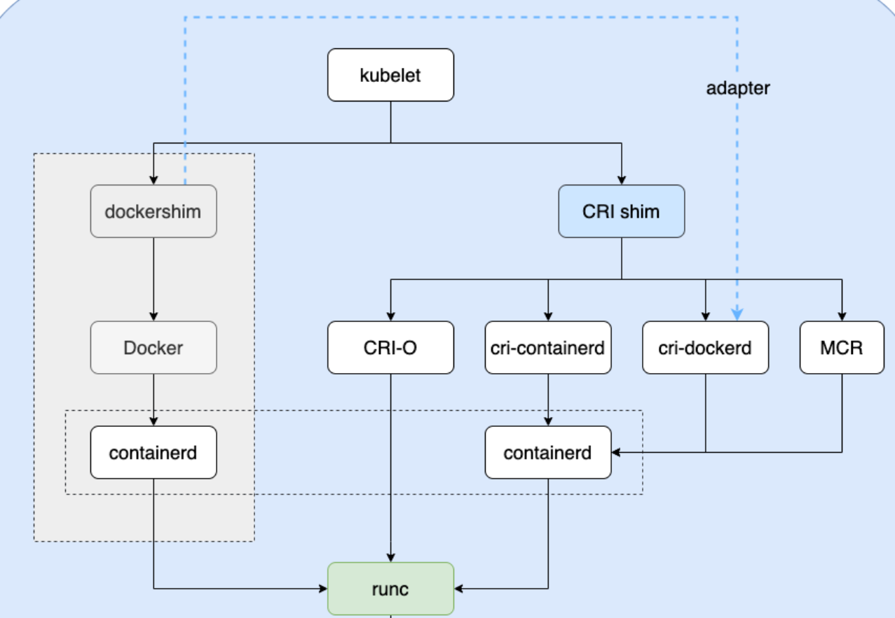

# CRI

## CRI Requirements

- [community/container-runtime-interface.md at master · kubernetes/community (github.com)](https://github.com/kubernetes/community/blob/master/contributors/devel/sig-node/container-runtime-interface.md)

```
staging/src/k8s.io/cri-api/pkg/apis/runtime/v1/api.pb.go/RuntimeServiceServer

staging/src/k8s.io/cri-api/pkg/apis/runtime/v1/api.pb.go/ImageServiceServer

staging/src/k8s.io/cri-api/pkg/apis/runtime/v1/api.proto
```

Pod由一组在资源隔离环境的容器构成。在K8s中，Pod是最小调度单位。为了区分Pod，使Pod内的容器作为一个整体，需要为Pod创建一个叫做PodSandbox的环境。PodSandbox可以有不同的实现方式，可以是hpyevisor中的虚拟机，也可以是Linux命名空间。一个PodSandbox应当满足以下条件:

- **隔离性**：虚拟机或Linux命名空间，或者支持更高的安全性。
- **资源计算和限制**：一个PodSandbox应当实现Pod级别的资源请求和限制。

### Networking

- [community/kubelet-cri-networking.md at master · kubernetes/community (github.com)](https://github.com/kubernetes/community/blob/master/contributors/devel/sig-node/kubelet-cri-networking.md)

Kubelet要求运行时shim在Podsandbox级别管理pod的网络生命周期。

- `RunPodSandbox`必须初始化 pod 的网络，包括分配pod IP，配置pod网络接口和默认路由。Kubelet要求Pod的沙盒拥有在k8s集群范围内可路由的IP。
- `StopPodSandbox`要求必须销毁Pod网络。如果销毁失败需要返回错误。
- `PodSandboxStatus`返回状态信息要包含PodSandbox的网络状态信息。如果获取失败也要返回空的网络状态信息。

用户级别支持的而非由K8s API暴露的Pod网络配置由运行时shim处理。

由K8s API暴露的网络配置(如podCIDR)要可以通过`UpdateRuntimeConfig`接口进行配置。

允许shim使用现有的CRI网络实现，如CNI, CNM。

### Container metrics

- [community/cri-container-stats.md at master · kubernetes/community (github.com)](https://github.com/kubernetes/community/blob/master/contributors/devel/sig-node/cri-container-stats.md)

Kubelet负责根据QoS创建Pod级别的cgroup，并将cgroup父目录传递给运行时，要求运行时确保Pod (包括PodSandBox和Container)所使用资源能够由cgroup进行控制，以便Kubelet有能力使用cAdvisor直接通过cgroup追踪资源使用情况。shim所提供的接口专注于容器级别的资源监控。

### Exec/attach/port-forward streaming requests

- https://docs.google.com/document/d/1OE_QoInPlVCK9rMAx9aybRmgFiVjHpJCHI9LrfdNM_s/edit?usp=sharing

CRI 接口主要包含两个部分：

- CRI Server，即通用的比如说创建、删除容器这样的接口；
- Streaming Server，一个是流式数据的接口。比如 exec、port-forward 这些流式数据

### xxxxxxxxxx kubeadm reset# $HOME 为普通用户目录rm -rf /etc/kubernetes/ /etc/cni/ $HOME/.kubeshell

- https://github.com/kubernetes/kubernetes/blob/release-1.5/docs/proposals/kubelet-cri-logging.md

1. 支持现有的所有日志相关功能，如`kubectl logs`，`kubectl logs --since`
2. 允许kubelet管理日志的生命周期。因此需要将容器和日志的生命周期解耦。
3. 与K8s的日志收集器相兼容

## K8s中常见的容器运行时

- containerd
  - [containerd/cri](https://github.com/containerd/cri)
- CRI-O
  - [cri-o/cri-o: Open Container Initiative-based implementation of Kubernetes Container Runtime Interface (github.com)](https://github.com/cri-o/cri-o)
- Docker Engine
  - [Mirantis/cri-dockerd: dockerd as a compliant Container Runtime Interface for Kubernetes (github.com)](https://github.com/Mirantis/cri-dockerd)

- Mirantis Container Runtime


