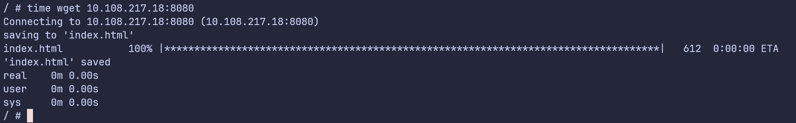
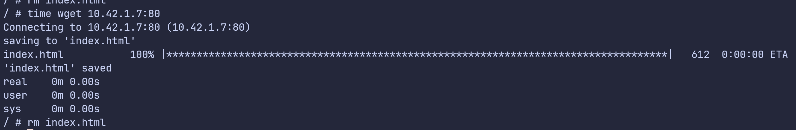
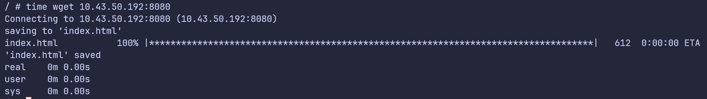
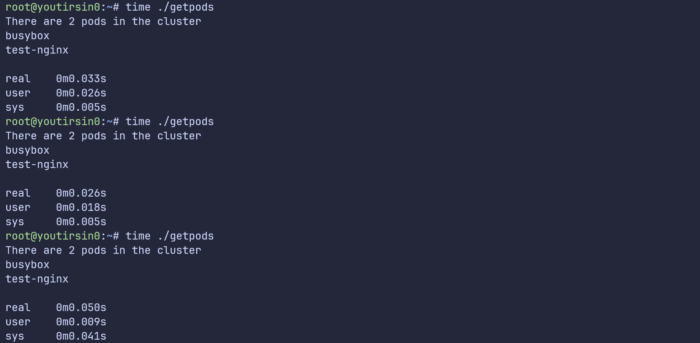
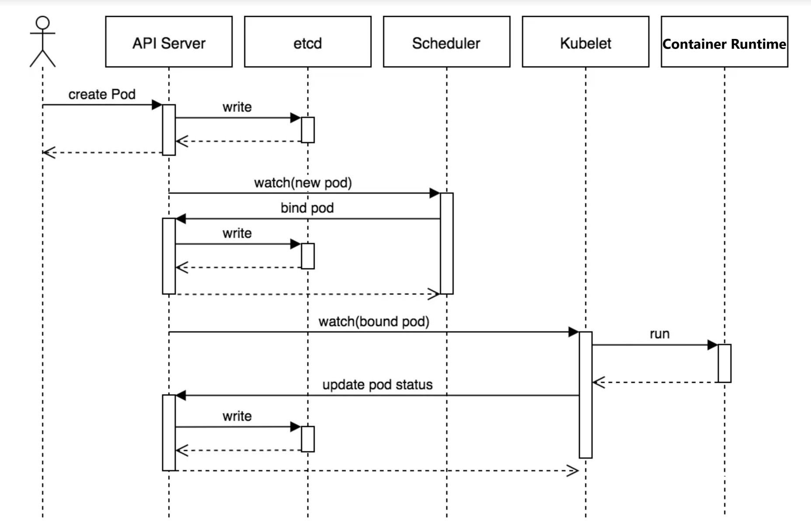
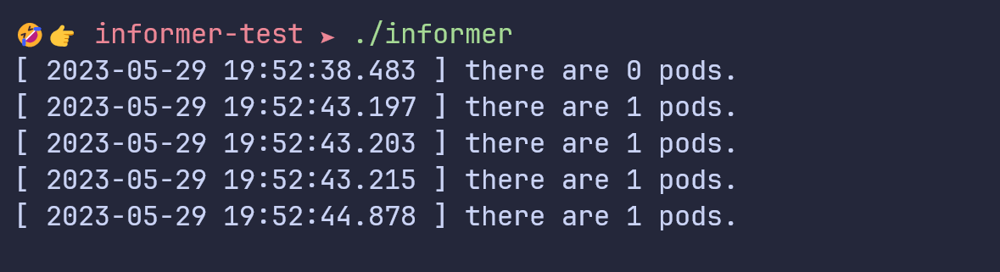
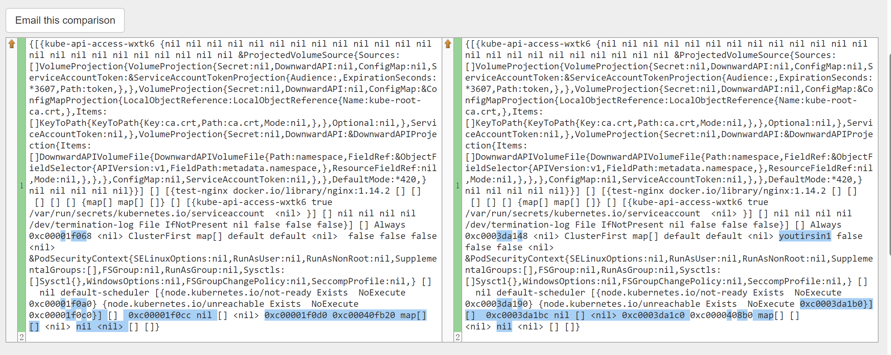

# K8s

**Service HTTP time cost**

service访问过程

1. 一个 Pod 通过 `[service-name]:[port]`发送请求。
2. Pod 内的 `/etc/resolve.conf`查找域名解析服务器为 `CoreDns` Service 的 IP。
3. Pod 通过 `CoreDns` Service 的 `ip:port` 的方式访问 DNS  服务。
4. kube-proxy 组件通过 iptables （或ipvs) 将 CoreDns Service 的 Cluster IP 换为了 CoreDNS Pod 的 Pod IP。（任何Service -> Pod 的访问都是这样）
5. Pod 通过 CoreDNS 提供的域名解析服务得到 Service 对应的 Cluster IP，然后通过 Cluster IP + port 的方式访问服务。

和常规 HTTP 访问过程基本一致，多了部分 IP 重定向步骤

Busybox Pod 通过 Service 访问 Nginx 服务耗时







**client-go**

- [Kubernetes client-go informer 架构介绍](https://zhuanlan.zhihu.com/p/212579372)

get pods (delete basicly the same)



**k8s workflow**



create pod




```
[ 2023-05-29 19:52:43.176 ] creating.				0
[ 2023-05-29 19:52:43.198 ] created.				22


[ 2023-05-29 19:52:38.483 ] there are 0 pods.		
[ 2023-05-29 19:52:43.197 ] there are 1 pods.		21
[ 2023-05-29 19:52:43.203 ] there are 1 pods.		27
[ 2023-05-29 19:52:43.215 ] there are 1 pods.		39
[ 2023-05-29 19:52:44.878 ] there are 1 pods.		712
```

```
[ 2023-05-29 20:10:25.321 ] creating.				0
[ 2023-05-29 20:10:25.351 ] created.				30


[ 2023-05-29 20:10:21.644 ] there are 0 pods.		
[ 2023-05-29 20:10:25.357 ] there are 1 pods.		36
[ 2023-05-29 20:10:25.357 ] there are 1 pods.		36
[ 2023-05-29 20:10:25.368 ] there are 1 pods.		47
[ 2023-05-29 20:10:26.127 ] there are 1 pods.		806
```

```
[ 2023-05-29 21:23:30.822 ] creating.				0
[ 2023-05-29 21:23:30.848 ] created.				26


[ 2023-05-29 21:23:26.883 ] there are 0 pods.
[ 2023-05-29 21:23:30.846 ] there are 1 pods.		24
[ 2023-05-29 21:23:30.852 ] there are 1 pods.		30
[ 2023-05-29 21:23:30.864 ] there are 1 pods.		42
[ 2023-05-29 21:23:31.911 ] there are 1 pods.		1089
```



create deployment

```
[ 2023-05-29 21:26:28.210 ] creating.			0
[ 2023-05-29 21:26:28.233 ] created.			23


[ 2023-05-29 21:26:24.079 ] there are 0 pods.
[ 2023-05-29 21:26:28.253 ] there are 1 pods.	43
[ 2023-05-29 21:26:28.271 ] there are 1 pods.	61
[ 2023-05-29 21:26:28.292 ] there are 1 pods.	82
[ 2023-05-29 21:26:29.249 ] there are 1 pods.	1039
```

```
[ 2023-05-29 21:34:43.417 ] creating.				0
[ 2023-05-29 21:34:43.461 ] created.				44


[ 2023-05-29 21:34:40.860 ] there are 0 pods.		
[ 2023-05-29 21:34:43.474 ] there are 1 pods.		57
[ 2023-05-29 21:34:43.484 ] there are 1 pods.		67
[ 2023-05-29 21:34:43.497 ] there are 1 pods.		80
[ 2023-05-29 21:34:44.304 ] there are 1 pods.		887
```

```
[ 2023-05-29 21:37:52.076 ] creating.				0
[ 2023-05-29 21:37:52.107 ] created.				31


[ 2023-05-29 21:37:49.857 ] there are 0 pods.
[ 2023-05-29 21:37:52.122 ] there are 1 pods.		46
[ 2023-05-29 21:37:52.140 ] there are 1 pods.		64
[ 2023-05-29 21:37:52.153 ] there are 1 pods.		77
[ 2023-05-29 21:37:53.729 ] there are 1 pods.		653
```


与先前测试时延差异可能原因

1. k3s 的问题
2. k3s 富集成的一些处理过程
3. 网络延迟
4. 机器性能
5. ......