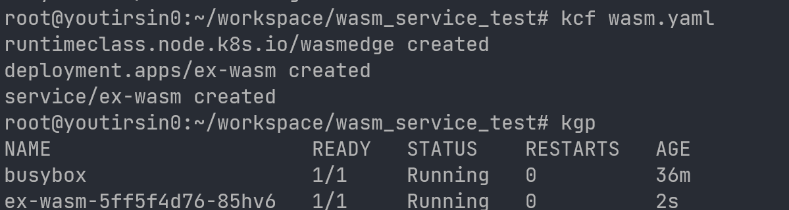
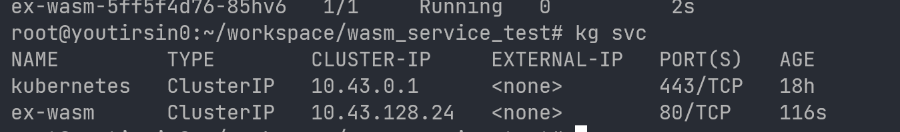
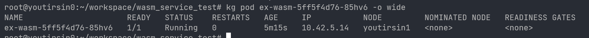
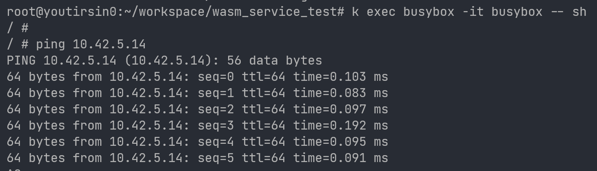
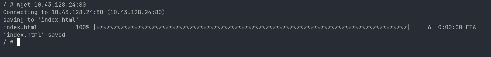
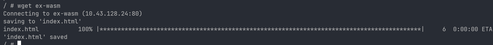

# 对接

## Tests with K8s

**创建 wasm container 的 yaml 模板：**

```yaml
apiVersion: node.k8s.io/v1
kind: RuntimeClass
metadata:
  name: wasmedge
handler: wasmedge
---
apiVersion: v1
kind: Pod
metadata:
  name: wasi-demo
  annotations:
    wasm.module.url: http:/[registry-http-server]/wasi-demo-app.wasm
    wasm.module.filename: wasi-demo-app.wasm
spec:
  runtimeClassName: wasmedge
  containers:
  - name: wasi-test
    image: wasi-demo-app
    command: ["wasi-demo-app.wasm"]
    args: ["daemon"]
```

**解决问题**

- K8s 所发送的请求和参数与 crictl 有所偏差，已针对 K8s 使用 cri 接口方式进行调整，

  如 annotation 的 wasm 信息传递，K8s 发送请求时会将其塞进 sandbox spec 和 image spec 中。

- K8s 依据 image ID 对镜像进行操作。

- ......

**仍存在问题**

<del>K8s 清除 pod 的时候似乎只调用 stop，不调用 remove。导致 pod 一直处于 terminating 状态。不过不影响现阶段使用，待后续验证和 debug。</del>

删除 wasm pod 的时候可以成功删除，据此可推断，是选用的containerd版本问题，后续把 wasm 模块迁移出来就可以解决。

### 示例

使用 wasmedge 官方提供的 http_server 示例，在 1234 端口开启 http 服务。

使用 service 为其他 pod 暴露 80 端口 对应该 1234 端口的 http 服务。(示例是 Fission 使用 K8s 的主要方式，Pod 之间通过 service 互相访问)

```yaml
---
apiVersion: node.k8s.io/v1
kind: RuntimeClass
metadata:
  name: wasmedge
handler: wasmedge
---
apiVersion: apps/v1
kind: Deployment
metadata:
  name: ex-wasm
  labels:
    svc: ex-wasm
spec:
  replicas: 1
  selector:
    matchLabels:
      svc: ex-wasm
  template:
    metadata:
      name: ex-wasm
      annotations:
        wasm.module.url: http://192.168.124.128:8080/http_server.wasm
        wasm.module.filename: http_server.wasm
      labels:
        svc: ex-wasm
    spec:
      runtimeClassName: wasmedge
      containers:
        - name: ex-wasm
          image: http_server.wasm
          command: ["http_server.wasm"]
---
apiVersion: v1
kind: Service
metadata:
  name: ex-wasm
  labels:
    svc: ex-wasm
spec:
  type: ClusterIP
  ports:
    - port: 80
      targetPort: 1234
  selector:
    svc: ex-wasm
```

**创建**





**测试**

进入 busybox，ping ex-wasm 的 ip，能 ping 通说明 pod ip 网络正常工作。





使用暴露的 service 通过 ip:port 进行访问。



使用暴露的 service 通过服务名的方式进行访问。(Fission 的访问方式)



## Fission

首先对原本的 Fission, K8s, Containerd 进行测试，保证本身是没问题的。

### official 1.17

```bash
# create
kubectl create -k "github.com/Fission/Fission/crds/v1?ref=v1.17.0"

export Fission_NAMESPACE="Fission"
kubectl create namespace $Fission_NAMESPACE
kubectl config set-context --current --namespace=$Fission_NAMESPACE

kubectl apply -f https://github.com/Fission/Fission/releases/download/v1.17.0/Fission-all-v1.17.0.yaml
# cli
curl -Lo Fission https://github.com/Fission/Fission/releases/download/v1.17.0/Fission-v1.17.0-linux-amd64 \
    && chmod +x Fission && sudo mv Fission /usr/local/bin/

# delete
kubectl delete -k "github.com/Fission/Fission/crds/v1?ref=v1.17.0"
kubectl delete -f https://github.com/Fission/Fission/releases/download/v1.17.0/Fission-all-v1.17.0.yaml
# namespace
kubectl config set-context --current --namespace=default
kubectl delete namespace Fission
# cli
rm /usr/local/bin/Fission
```

结果没有正常运行，经过排查发现了一系列原因：

- 官方步骤安装的裸 K8s，网络无法提供 Fission 所需要的 Cluster IP service 能力。
- Fission 不支持 1.26 版本以上的 K8s，但是官方并未发现，只标明 1.19+。

没有一个稳定且成熟的公共 K8s 来进行上下各方面的测试。经过调研和测试，选择使用 K3s 在云服务器搭建 K8s 1.25 集群。

### K3s

K3s is a fully compliant Kubernetes distribution with the following enhancements.

Lightweight Kubernetes. Easy to install, half the memory, all in a binary of less than 100 MB.

Great for:

- Edge
- IoT
- CI
- Development
- ARM
- Embedding K8s
- Situations where a PhD in K8s clusterology is infeasible

Simple but powerful "batteries-included" features have been added, such as:

- local storage provider
- service load balancer
- Helm controller
- Traefik ingress controller.

External dependencies have been minimized (just a modern kernel and cgroup mounts needed). K3s packages the required dependencies, including:

- containerd
- Flannel (CNI)
- CoreDNS
- Traefik (Ingress)
- Klipper-lb (Service LB)
- Embedded network policy controller
- Embedded local-path-provisioner
- Host utilities (iptables, socat, etc)

K3s 是一个轻量级 K3s 发行版，部署容易而且在生产环境中也有广泛应用。其去除了原本 K8s 中遗弃和 Alpha 内容，并且配置了网络, Helm 等等。并且支持使用指定的 containerd，能够满足我们的需求。

指定使用1.25版本，以支持 Fission

```bash
# server
curl -sfL https://get.k3s.io | sh -
# v1.25.7+k3s1
curl -sfL https://get.k3s.io | INSTALL_K3S_VERSION=v1.25.7+k3s1 sh -

# agent
curl -sfL https://get.k3s.io | K3S_URL=https://192.168.124.129:6443 K3S_TOKEN=mynodetoken sh -
# v1.25.7+k3s1
curl -sfL https://get.k3s.io | INSTALL_K3S_VERSION=v1.25.7+k3s1 K3S_URL=https://192.168.124.129:6443 K3S_TOKEN=mynodetoken sh -


curl -sfL https://get.k3s.io | INSTALL_K3S_VERSION=v1.25.7+k3s1 K3S_URL=https://192.168.124.129:6443 K3S_TOKEN=mynodetoken sh -s - --container-runtime-endpoint /run/containerd/containerd.sock
```

指定外部 containerd 后，修改 containerd 的配置文件，使 containerd cni 的插件和配置文件使用 k3s 提供的 cni 插件和配置文件。

```toml
[plugins."io.containerd.grpc.v1.cri".cni]
	...
    # bin_dir = "/opt/cni/bin"
    # conf_dir = "/etc/cni/net.d"
    bin_dir = "/var/lib/rancher/k3s/data/current/bin"
    conf_dir = "/var/lib/rancher/k3s/agent/etc/cni/net.d"
    ...
```

目前工作节点安装K8s前需要的程序：

- containerd
- runc
- runc shim
- wasmedge shim
- wasmedge