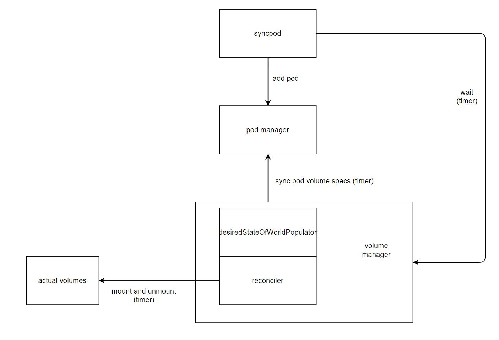

## kubelet 时延问题

kubelet 时延大约 300 多 ms，经过测试和排查，找到了时延问题所在。

从 kubelet 的核心函数 syncpod 开始打时间戳进行测试。

## syncpod

```
Jun 20 08:49:34 youtirsin1 kubelet[14921]: I0620 08:49:34.602831   14921 kubelet.go:1523] [--- test-wasm-54b8454f8c-rr6jh ---] start syncPod
Jun 20 08:49:34 youtirsin1 kubelet[14921]: I0620 08:49:34.602848   14921 kubelet.go:1540] [--- test-wasm-54b8454f8c-rr6jh ---] 1 start recording latency
Jun 20 08:49:34 youtirsin1 kubelet[14921]: I0620 08:49:34.602858   14921 kubelet.go:1555] [--- test-wasm-54b8454f8c-rr6jh ---] 2 start generateAPIPodStatus
Jun 20 08:49:34 youtirsin1 kubelet[14921]: I0620 08:49:34.602911   14921 kubelet.go:1576] [--- test-wasm-54b8454f8c-rr6jh ---] 3 start test canRunPod
Jun 20 08:49:34 youtirsin1 kubelet[14921]: I0620 08:49:34.602922   14921 kubelet.go:1602] [--- test-wasm-54b8454f8c-rr6jh ---] 4 start GetPodStatus
Jun 20 08:49:34 youtirsin1 kubelet[14921]: I0620 08:49:34.602962   14921 kubelet.go:1630] [--- test-wasm-54b8454f8c-rr6jh ---] 5 start test network
Jun 20 08:49:34 youtirsin1 kubelet[14921]: I0620 08:49:34.602991   14921 kubelet.go:1647] [--- test-wasm-54b8454f8c-rr6jh ---] 6 start Create Cgroups
Jun 20 08:49:34 youtirsin1 kubelet[14921]: I0620 08:49:34.632338   14921 kubelet.go:1698] [--- test-wasm-54b8454f8c-rr6jh ---] 7 start create mirror pod
Jun 20 08:49:34 youtirsin1 kubelet[14921]: I0620 08:49:34.632380   14921 kubelet.go:1730] [--- test-wasm-54b8454f8c-rr6jh ---] 7 start Make data directories
Jun 20 08:49:34 youtirsin1 kubelet[14921]: I0620 08:49:34.934262   14921 kubelet.go:1749] [--- test-wasm-54b8454f8c-rr6jh ---] 8 Fetch the pull secrets
Jun 20 08:49:34 youtirsin1 kubelet[14921]: I0620 08:49:34.934317   14921 kubelet.go:1757] [--- test-wasm-54b8454f8c-rr6jh ---] 9 containerRuntime.SyncPod
Jun 20 08:49:35 youtirsin1 kubelet[14921]: I0620 08:49:35.037833   14921 kubelet.go:1525] [--- test-wasm-54b8454f8c-rr6jh ---] end syncPod

```

| stage                         | time 1 | time 2 |
| ----------------------------- | ------ | ------ |
| start syncPod                 | 0      | 0      |
| 1 start recording latency     | 0      | 0      |
| 2 start generateAPIPodStatus  | 0      | 0      |
| 3 start test canRunPod        | 0      | 0      |
| 4 start GetPodStatus          | 0      | 0      |
| 5 start test network          | 0      | 0      |
| 6 start Create Cgroups        | 0      | 0      |
| 7 start create mirror pod     | 28     | 24     |
| 8 start Make data directories | 0      | 0      |
| 9 start Volume manager        | 1      | 1      |
| 10 Fetch the pull secrets     | 301    | 301    |
| 11 containerRuntime.SyncPod   | 0      | 0      |
| end syncPod                   | 165    | 111    |

```
Jun 20 09:33:18 youtirsin1 kubelet[27477]: I0620 09:33:18.548686   27477 kubelet.go:1523] [--- test-wasm-54b8454f8c-dp6f5 ---] start syncPod
Jun 20 09:33:18 youtirsin1 kubelet[27477]: I0620 09:33:18.548695   27477 kubelet.go:1540] [--- test-wasm-54b8454f8c-dp6f5 ---] 1 start recording latency
Jun 20 09:33:18 youtirsin1 kubelet[27477]: I0620 09:33:18.548702   27477 kubelet.go:1555] [--- test-wasm-54b8454f8c-dp6f5 ---] 2 start generateAPIPodStatus
Jun 20 09:33:18 youtirsin1 kubelet[27477]: I0620 09:33:18.548762   27477 kubelet.go:1576] [--- test-wasm-54b8454f8c-dp6f5 ---] 3 start test canRunPod
Jun 20 09:33:18 youtirsin1 kubelet[27477]: I0620 09:33:18.548769   27477 kubelet.go:1602] [--- test-wasm-54b8454f8c-dp6f5 ---] 4 start GetPodStatus
Jun 20 09:33:18 youtirsin1 kubelet[27477]: I0620 09:33:18.548789   27477 kubelet.go:1630] [--- test-wasm-54b8454f8c-dp6f5 ---] 5 start test network
Jun 20 09:33:18 youtirsin1 kubelet[27477]: I0620 09:33:18.548793   27477 pod_workers.go:474] [--- a2ce6cac-ee39-42b5-b997-fd9bd75ca0f3 ---] IsPodTerminationRequested getting podWorkers lock
Jun 20 09:33:18 youtirsin1 kubelet[27477]: I0620 09:33:18.548796   27477 pod_workers.go:477] [--- a2ce6cac-ee39-42b5-b997-fd9bd75ca0f3 ---] IsPodTerminationRequested getting pod status
Jun 20 09:33:18 youtirsin1 kubelet[27477]: I0620 09:33:18.548819   27477 kubelet.go:1647] [--- test-wasm-54b8454f8c-dp6f5 ---] 6 start Create Cgroups
Jun 20 09:33:18 youtirsin1 kubelet[27477]: I0620 09:33:18.548823   27477 pod_workers.go:474] [--- a2ce6cac-ee39-42b5-b997-fd9bd75ca0f3 ---] IsPodTerminationRequested getting podWorkers lock
Jun 20 09:33:18 youtirsin1 kubelet[27477]: I0620 09:33:18.548825   27477 pod_workers.go:477] [--- a2ce6cac-ee39-42b5-b997-fd9bd75ca0f3 ---] IsPodTerminationRequested getting pod status
Jun 20 09:33:18 youtirsin1 kubelet[27477]: I0620 09:33:18.574402   27477 kubelet.go:1698] [--- test-wasm-54b8454f8c-dp6f5 ---] 7 start create mirror pod
Jun 20 09:33:18 youtirsin1 kubelet[27477]: I0620 09:33:18.574527   27477 kubelet.go:1730] [--- test-wasm-54b8454f8c-dp6f5 ---] 8 start Make data directories
Jun 20 09:33:18 youtirsin1 kubelet[27477]: I0620 09:33:18.574674   27477 kubelet.go:1738] [--- test-wasm-54b8454f8c-dp6f5 ---] 9 start Volume manager
Jun 20 09:33:18 youtirsin1 kubelet[27477]: I0620 09:33:18.574765   27477 pod_workers.go:474] [--- a2ce6cac-ee39-42b5-b997-fd9bd75ca0f3 ---] IsPodTerminationRequested getting podWorkers lock
Jun 20 09:33:18 youtirsin1 kubelet[27477]: I0620 09:33:18.574849   27477 pod_workers.go:477] [--- a2ce6cac-ee39-42b5-b997-fd9bd75ca0f3 ---] IsPodTerminationRequested getting pod status
Jun 20 09:33:18 youtirsin1 kubelet[27477]: I0620 09:33:18.574897   27477 kubelet.go:1743] [--- test-wasm-54b8454f8c-dp6f5 ---] 9.5 start WaitForAttachAndMount
Jun 20 09:33:18 youtirsin1 kubelet[27477]: I0620 09:33:18.624998   27477 reconciler.go:357] "operationExecutor.VerifyControllerAttachedVolume started for volume \"kube-api-access-jxxvr\" (UniqueName: \"kubernetes.io/projected/a2ce6cac-ee39-42b5-b997-fd9bd75ca0f3-kube-api-access-jxxvr\") pod \"test-wasm-54b8454f8c-dp6f5\" (UID: \"a2ce6cac-ee39-42b5-b997-fd9bd75ca0f3\") " pod="default/test-wasm-54b8454f8c-dp6f5"
Jun 20 09:33:18 youtirsin1 kubelet[27477]: I0620 09:33:18.875571   27477 kubelet.go:1751] [--- test-wasm-54b8454f8c-dp6f5 ---] 10 Fetch the pull secrets
Jun 20 09:33:18 youtirsin1 kubelet[27477]: I0620 09:33:18.876031   27477 kubelet.go:1759] [--- test-wasm-54b8454f8c-dp6f5 ---] 11 containerRuntime.SyncPod
Jun 20 09:33:18 youtirsin1 kubelet[27477]: I0620 09:33:18.973887   27477 kubelet.go:1525] [--- test-wasm-54b8454f8c-dp6f5 ---] end syncPod

```


| stage                                             | time |
| ------------------------------------------------- | ---- |
| 9 start Volume manager                            | 1    |
| IsPodTerminationRequested getting podWorkers lock | 0    |
| IsPodTerminationRequested getting pod status      | 0    |
| 9.5 start WaitForAttachAndMount                   | 0    |
| operationExecutor.VerifyControllerAttachedVolume  | 50   |
| 10 Fetch the pull secrets                         | 251  |


**WaitForAttachAndMount**


```
[ 2023-06-25 13:32:40.664 ] creating.
[ 2023-06-25 13:32:40.680 ] created.


Jun 25 05:32:40 youtirsin1 kubelet[3177]: I0625 05:32:40.673778    3177 volume_manager.go:398] [--- test-wasm-54b8454f8c-qrxmb ---] start WaitForAttachAndMount
0
Jun 25 05:32:40 youtirsin1 kubelet[3177]: I0625 05:32:40.673813    3177 volume_manager.go:407] [--- test-wasm-54b8454f8c-qrxmb ---] 1 getExpectedVolumes
0
Jun 25 05:32:40 youtirsin1 kubelet[3177]: I0625 05:32:40.673824    3177 volume_manager.go:414] [--- test-wasm-54b8454f8c-qrxmb ---] 2 GetUniquePodName
0
Jun 25 05:32:40 youtirsin1 kubelet[3177]: I0625 05:32:40.673831    3177 volume_manager.go:418] [--- test-wasm-54b8454f8c-qrxmb ---] 3 ReprocessPod
0
Jun 25 05:32:40 youtirsin1 kubelet[3177]: I0625 05:32:40.673839    3177 volume_manager.go:424] [--- test-wasm-54b8454f8c-qrxmb ---] 4 PollImmediate
0
Jun 25 05:32:40 youtirsin1 kubelet[3177]: I0625 05:32:40.974151    3177 volume_manager.go:430] [--- test-wasm-54b8454f8c-qrxmb ---] 5 get volumes
301
Jun 25 05:32:40 youtirsin1 kubelet[3177]: I0625 05:32:40.974198    3177 volume_manager.go:400] [--- test-wasm-54b8454f8c-qrxmb ---] end WaitForAttachAndMount
0
```


| stage                       | time |
| --------------------------- | ---- |
| start WaitForAttachAndMount | 0    |
| 1 getExpectedVolumes        | 0    |
| 2 GetUniquePodName          | 0    |
| 3 ReprocessPod              | 0    |
| 4 PollImmediate             | 0    |
| 5 get volumes               | 301  |
| end WaitForAttachAndMount   | 0    |


**PollImmediate**

持续等待条件，轮询，间隔300ms

```go
err := wait.PollImmediate(
		podAttachAndMountRetryInterval,
		podAttachAndMountTimeout,
		vm.verifyVolumesMountedFunc(uniquePodName, expectedVolumes))

// vars

const podAttachAndMountRetryInterval time.Duration = 300 * time.Millisecond // 300ms


// func

// verifyVolumesMountedFunc returns a method that returns true when all expected
// volumes are mounted.
func (vm *volumeManager) verifyVolumesMountedFunc(podName types.UniquePodName, expectedVolumes []string) wait.ConditionFunc {
	return func() (done bool, err error) {
		if errs := vm.desiredStateOfWorld.PopPodErrors(podName); len(errs) > 0 {
			return true, errors.New(strings.Join(errs, "; "))
		}
		return len(vm.getUnmountedVolumes(podName, expectedVolumes)) == 0, nil
	}
}
```


改为 30ms

```
Jun 25 06:14:36 youtirsin1 kubelet[15774]: I0625 06:14:36.488893   15774 kubelet.go:1523] [------] syncPod start
Jun 25 06:14:36 youtirsin1 kubelet[15774]: I0625 06:14:36.515221   15774 volume_manager.go:398] [------] WaitForAttachAndMount start
Jun 25 06:14:36 youtirsin1 kubelet[15774]: I0625 06:14:36.515270   15774 volume_manager.go:417] [------] PollImmediate start
Jun 25 06:14:36 youtirsin1 kubelet[15774]: I0625 06:14:36.515333   15774 volume_manager.go:498] [------] verifyVolumesMountedFunc start
Jun 25 06:14:36 youtirsin1 kubelet[15774]: I0625 06:14:36.515438   15774 volume_manager.go:503] [------] getUnmountedVolumes: 1
Jun 25 06:14:36 youtirsin1 kubelet[15774]: I0625 06:14:36.545668   15774 volume_manager.go:498] [------] verifyVolumesMountedFunc start
Jun 25 06:14:36 youtirsin1 kubelet[15774]: I0625 06:14:36.545717   15774 volume_manager.go:503] [------] getUnmountedVolumes: 1
Jun 25 06:14:36 youtirsin1 kubelet[15774]: I0625 06:14:36.576359   15774 volume_manager.go:498] [------] verifyVolumesMountedFunc start
Jun 25 06:14:36 youtirsin1 kubelet[15774]: I0625 06:14:36.576417   15774 volume_manager.go:503] [------] getUnmountedVolumes: 1
Jun 25 06:14:36 youtirsin1 kubelet[15774]: I0625 06:14:36.593992   15774 reconciler.go:357] "operationExecutor.VerifyControllerAttachedVolume started for volume \"kube-api-access-lxstq\" (UniqueName: \"kubernetes.io/projected/04b2f2da-99a5-463c-a8d5-3c1487431201-kube-api-access-lxstq\") pod \"test-wasm-54b8454f8c-8fk4p\" (UID: \"04b2f2da-99a5-463c-a8d5-3c1487431201\") " pod="default/test-wasm-54b8454f8c-8fk4p"
Jun 25 06:14:36 youtirsin1 kubelet[15774]: I0625 06:14:36.605731   15774 volume_manager.go:498] [------] verifyVolumesMountedFunc start
Jun 25 06:14:36 youtirsin1 kubelet[15774]: I0625 06:14:36.605777   15774 volume_manager.go:503] [------] getUnmountedVolumes: 1
Jun 25 06:14:36 youtirsin1 kubelet[15774]: I0625 06:14:36.637114   15774 volume_manager.go:498] [------] verifyVolumesMountedFunc start
Jun 25 06:14:36 youtirsin1 kubelet[15774]: I0625 06:14:36.637343   15774 volume_manager.go:503] [------] getUnmountedVolumes: 1
Jun 25 06:14:36 youtirsin1 kubelet[15774]: I0625 06:14:36.666129   15774 volume_manager.go:498] [------] verifyVolumesMountedFunc start
Jun 25 06:14:36 youtirsin1 kubelet[15774]: I0625 06:14:36.666166   15774 volume_manager.go:503] [------] getUnmountedVolumes: 1
Jun 25 06:14:36 youtirsin1 kubelet[15774]: I0625 06:14:36.695503   15774 volume_manager.go:498] [------] verifyVolumesMountedFunc start
Jun 25 06:14:36 youtirsin1 kubelet[15774]: I0625 06:14:36.695708   15774 volume_manager.go:503] [------] getUnmountedVolumes: 1
Jun 25 06:14:36 youtirsin1 kubelet[15774]: I0625 06:14:36.726129   15774 volume_manager.go:498] [------] verifyVolumesMountedFunc start
Jun 25 06:14:36 youtirsin1 kubelet[15774]: I0625 06:14:36.726221   15774 volume_manager.go:503] [------] getUnmountedVolumes: 0
Jun 25 06:14:36 youtirsin1 kubelet[15774]: I0625 06:14:36.726246   15774 volume_manager.go:422] [------] PollImmediate end
Jun 25 06:14:36 youtirsin1 kubelet[15774]: I0625 06:14:36.726466   15774 kuberuntime_manager.go:757] [------] createPodSandbox called
```

调用了多次，耗时211ms


发现耗时在1个 volume 的挂载

```
kube-api-access-sxdtb
```


```
> kubelet describe pod test-wasm-54b8454f8c-cztvj

Volumes:
  kube-api-access-xnt2r:
    Type:                    Projected (a volume that contains injected data from multiple sources)
    TokenExpirationSeconds:  3607
    ConfigMapName:           kube-root-ca.crt
    ConfigMapOptional:       <nil>
    DownwardAPI:             true
```

- [投射卷 | Kubernetes](https://kubernetes.io/zh-cn/docs/concepts/storage/projected-volumes/)

一个 `projected` 卷可以将若干现有的卷源映射到同一个目录之上。

目前，以下类型的卷源可以被投射：

- [`secret`](https://kubernetes.io/zh-cn/docs/concepts/storage/volumes/#secret)
- [`downwardAPI`](https://kubernetes.io/zh-cn/docs/concepts/storage/volumes/#downwardapi)
- [`configMap`](https://kubernetes.io/zh-cn/docs/concepts/storage/volumes/#configmap)
- [`serviceAccountToken`](https://kubernetes.io/zh-cn/docs/concepts/storage/projected-volumes/#serviceaccounttoken)


**挂两个呢？**

再挂一个emptyDir

```yaml
apiVersion: v1
kind: Pod
metadata:
  name: test-wasm
spec:
  runtimeClassName: wasm
  containers:
  - name: test-wasm
    image: ghcr.io/containerd/runwasi/wasi-demo-app:v0.0.1
    command: ['wasi-demo-app.wasm', 'daemon']
    volumeMounts:
    - mountPath: /cache
      name: cache-volume
  volumes:
  - name: cache-volume
    emptyDir:
      sizeLimit: 500Mi
```


```
Jun 25 07:56:21 youtirsin1 kubelet[42820]: I0625 07:56:21.870497   42820 volume_manager.go:407] [---test-wasm---] volumes:
Jun 25 07:56:21 youtirsin1 kubelet[42820]: I0625 07:56:21.870530   42820 volume_manager.go:409] [---test-wasm---]: cache-volume
Jun 25 07:56:21 youtirsin1 kubelet[42820]: I0625 07:56:21.870536   42820 volume_manager.go:409] [---test-wasm---]: kube-api-access-5ctj7
Jun 25 07:56:21 youtirsin1 kubelet[42820]: I0625 07:56:21.870544   42820 volume_manager.go:420] [---test-wasm---] PollImmediate start
Jun 25 07:56:21 youtirsin1 kubelet[42820]: I0625 07:56:21.870564   42820 volume_manager.go:505] [---a5ab242c-eda2-4b69-9045-4dafa803592e---] getUnmountedVolumes 2
Jun 25 07:56:21 youtirsin1 kubelet[42820]: I0625 07:56:21.901403   42820 volume_manager.go:505] [---a5ab242c-eda2-4b69-9045-4dafa803592e---] getUnmountedVolumes 2
Jun 25 07:56:21 youtirsin1 kubelet[42820]: I0625 07:56:21.931181   42820 volume_manager.go:505] [---a5ab242c-eda2-4b69-9045-4dafa803592e---] getUnmountedVolumes 2
Jun 25 07:56:21 youtirsin1 kubelet[42820]: I0625 07:56:21.950131   42820 reconciler.go:357] "operationExecutor.VerifyControllerAttachedVolume started for volume \"cache-volume\" (UniqueName: \"kubernetes.io/empty-dir/a5ab242c-eda2-4b69-9045-4dafa803592e-cache-volume\") pod \"test-wasm\" (UID: \"a5ab242c-eda2-4b69-9045-4dafa803592e\") " pod="default/test-wasm"
Jun 25 07:56:21 youtirsin1 kubelet[42820]: I0625 07:56:21.950234   42820 reconciler.go:357] "operationExecutor.VerifyControllerAttachedVolume started for volume \"kube-api-access-5ctj7\" (UniqueName: \"kubernetes.io/projected/a5ab242c-eda2-4b69-9045-4dafa803592e-kube-api-access-5ctj7\") pod \"test-wasm\" (UID: \"a5ab242c-eda2-4b69-9045-4dafa803592e\") " pod="default/test-wasm"
Jun 25 07:56:21 youtirsin1 kubelet[42820]: I0625 07:56:21.961438   42820 volume_manager.go:505] [---a5ab242c-eda2-4b69-9045-4dafa803592e---] getUnmountedVolumes 2
Jun 25 07:56:21 youtirsin1 kubelet[42820]: I0625 07:56:21.991380   42820 volume_manager.go:505] [---a5ab242c-eda2-4b69-9045-4dafa803592e---] getUnmountedVolumes 2
Jun 25 07:56:22 youtirsin1 kubelet[42820]: I0625 07:56:22.020899   42820 volume_manager.go:505] [---a5ab242c-eda2-4b69-9045-4dafa803592e---] getUnmountedVolumes 2
Jun 25 07:56:22 youtirsin1 kubelet[42820]: I0625 07:56:22.051244   42820 volume_manager.go:505] [---a5ab242c-eda2-4b69-9045-4dafa803592e---] getUnmountedVolumes 2
Jun 25 07:56:22 youtirsin1 kubelet[42820]: I0625 07:56:22.081529   42820 volume_manager.go:505] [---a5ab242c-eda2-4b69-9045-4dafa803592e---] getUnmountedVolumes 0
Jun 25 07:56:22 youtirsin1 kubelet[42820]: I0625 07:56:22.081631   42820 volume_manager.go:425] [---test-wasm---] PollImmediate end
Jun 25 07:56:22 youtirsin1 kubelet[42820]: I0625 07:56:22.081692   42820 kuberuntime_manager.go:757] [------] createPodSandbox called
```


## volumeManager

主要协程

```go
go vm.desiredStateOfWorldPopulator.Run(sourcesReady, stopCh)

go vm.reconciler.Run(stopCh)
```

### desiredStateOfWorldPopulator

定期更新和获取 volume 信息。

两个定时器。

每隔 100ms 执行 findAndAddNewPods。

每隔 2s 执行 findAndRemoveDeletedPods。（代价比较高昂，因此会检查执行的间隔时间）

```go
// desiredStateOfWorldPopulatorLoopSleepPeriod is the amount of time the
// DesiredStateOfWorldPopulator loop waits between successive executions
desiredStateOfWorldPopulatorLoopSleepPeriod = 100 * time.Millisecond

// desiredStateOfWorldPopulatorGetPodStatusRetryDuration is the amount of
// time the DesiredStateOfWorldPopulator loop waits between successive pod
// cleanup calls (to prevent calling containerruntime.GetPodStatus too
// frequently).
desiredStateOfWorldPopulatorGetPodStatusRetryDuration = 2 * time.Second
```

### reconciler

同步 volume 挂载状态，解挂与挂载。

定时器间隔 100ms。

```go
// reconcilerLoopSleepPeriod is the amount of time the reconciler loop waits
// between successive executions
reconcilerLoopSleepPeriod = 100 * time.Millisecond
```


## 总结



wait timer 时间最长，设其为 x，耗时区间为 [x, 2x]。


## 更改

更改定时器间隔

```go
// plegRelistPeriod = time.Second * 1
plegRelistPeriod = time.Millisecond * 100


// reconcilerLoopSleepPeriod = 100 * time.Millisecond
reconcilerLoopSleepPeriod = 10 * time.Millisecond


// desiredStateOfWorldPopulatorLoopSleepPeriod = 100 * time.Millisecond
desiredStateOfWorldPopulatorLoopSleepPeriod = 10 * time.Millisecond


// podAttachAndMountRetryInterval = 300 * time.Millisecond
podAttachAndMountRetryInterval = 30 * time.Millisecond
```


```
[ 2023-06-25 16:45:57.656 ] creating.								0
[ 2023-06-25 16:45:57.708 ] created.								52


[ 2023-06-25 16:45:57.720 ] there are 1 pods. status: Pending		64
[ 2023-06-25 16:45:57.730 ] there are 1 pods. status: Pending		
[ 2023-06-25 16:45:57.747 ] there are 1 pods. status: Pending		91
[ 2023-06-25 16:45:57.975 ] there are 1 pods. status: Running		319


Jun 25 08:45:57 youtirsin1 kubelet[56731]: I0625 08:45:57.664803   56731 kubelet.go:2240] [------] HandlePodAdditions started
8
Jun 25 08:45:57 youtirsin1 kubelet[56731]: I0625 08:45:57.720497   56731 kuberuntime_manager.go:757] [------] createPodSandbox called
64


INFO[2023-06-25T08:45:57.721171664Z] RunPodSandbox for &PodSandboxMetadata{Name:test-wasm-54b8454f8c-dgvxv,Uid:2a53446b-c5eb-4d05-a2a5-f975c7a820b0,Namespace:default,Attempt:0,}
65
INFO[2023-06-25T08:45:57.763439034Z] RunPodSandbox for &PodSandboxMetadata{Name:test-wasm-54b8454f8c-dgvxv,Uid:2a53446b-c5eb-4d05-a2a5-f975c7a820b0,Namespace:default,Attempt:0,} returns sandbox id "999a71b291996f1a30fd31804a4637a865189af730ef829af346fe301af03034"
107
INFO[2023-06-25T08:45:57.769400335Z] CreateContainer within sandbox "999a71b291996f1a30fd31804a4637a865189af730ef829af346fe301af03034" for container &ContainerMetadata{Name:test-wasm,Attempt:0,}
113
INFO[2023-06-25T08:45:57.790071742Z] CreateContainer within sandbox "999a71b291996f1a30fd31804a4637a865189af730ef829af346fe301af03034" for &ContainerMetadata{Name:test-wasm,Attempt:0,} returns container id "5edd203f85540ce4ca229f6cd588f689dda1845e3076163f4a81fea05284e8bf"
134
INFO[2023-06-25T08:45:57.791308580Z] StartContainer for "5edd203f85540ce4ca229f6cd588f689dda1845e3076163f4a81fea05284e8bf"
135
INFO[2023-06-25T08:45:57.810214290Z] StartContainer for "5edd203f85540ce4ca229f6cd588f689dda1845e3076163f4a81fea05284e8bf" returns successfully
154
```


| stage               | time stamp (1st) | time stamp (2nd) |
| ------------------- | ---------------- | ---------------- |
| deployment creating | 0                | 0                |
| deployment created  | 52               | 18               |
| pod sensed          | 64               | 30               |
| scheduled           | 91               | 56               |
| kubelet sensed      | 8                | 8                |
| kubelet cri call    | 64               | 48               |
| runpod starting     | 65               | 49               |
| runpod started      | 107              | 102              |
| container creating  | 113              | 105              |
| container created   | 134              | 133              |
| container starting  | 135              | 134              |
| container started   | 154              | 145              |
| sensed running      | 319              | 284              |


## refer

- [(57条消息) kubelet源码分析（五）之 syncPod_胡伟煌的博客-CSDN博客](https://blog.csdn.net/huwh_/article/details/96014277)

volumeManager

- [volumeManager 的运行 - 简书 (jianshu.com)](https://www.jianshu.com/p/8dfdbe5c2a11/)