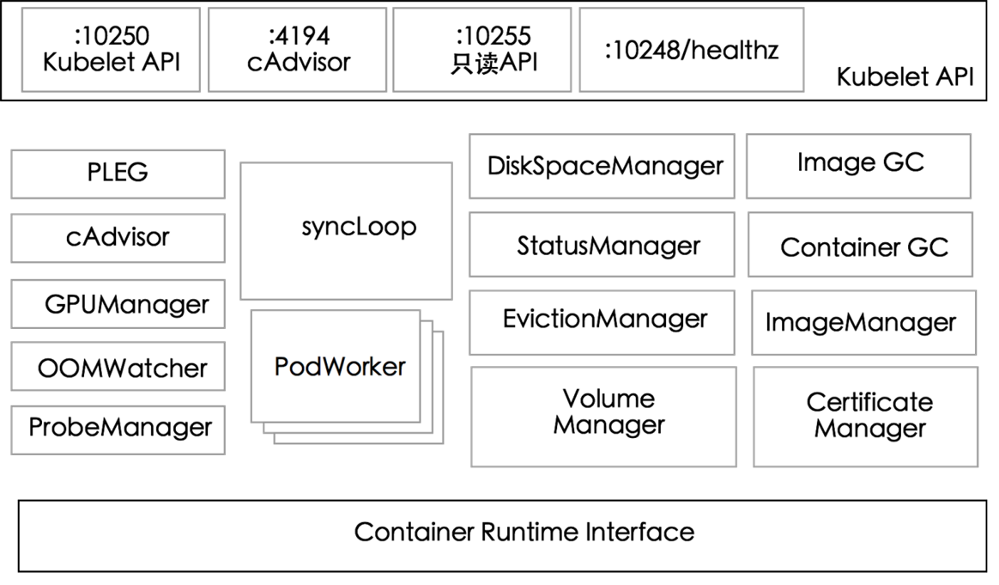

# 镜像服务



与镜像相关的组件有：

**imageGCManager**

负责 node 节点的镜像回收，当本地的存放镜像的本地磁盘空间达到某阈值的时候，会触发镜像的回收，删除掉不被 pod 所使用的镜像，回收镜像的阈值可以通过 kubelet 的启动参数 `--image-gc-high-threshold` 和` --image-gc-low-threshold `来设置。

**imageManager**

是用于管理镜像的，主要用于下载、管理、删除容器镜像。只包含一个`EnsureImageExists`方法，调用 kubecontainer 提供的`PullImage/GetImageRef/ListImages/RemoveImage/ImageStates` 方法来保证pod 运行所需要的镜像。保证容器启动时其镜像存在。

**runtimeManager**

containerRuntime 负责 kubelet 与不同的 runtime 实现进行对接，实现对于底层 container 的操作，初始化之后得到的 runtime 实例将会被其他组件所使用。

imageGCManager 和 imageManager 通过调用 runtimeManager 的接口来实现。

## runtimeManager

```go
// KubeGenericRuntime is a interface contains interfaces for container runtime and command.
type KubeGenericRuntime interface {
	kubecontainer.Runtime
	kubecontainer.StreamingRuntime
	kubecontainer.CommandRunner
}
```

实现包含了 Runtime、StreamingRuntime 和 CommandRunner三种接口。StreamingRuntime 中包含了和`exec/attach/portforward`相关的接口。CommandRunner 接口用于在容器中执行命令。

Runtime 中的镜像服务相关接口：

```go
// ImageService interfaces allows to work with image service.
type ImageService interface {
	// PullImage pulls an image from the network to local storage using the supplied
	// secrets if necessary. It returns a reference (digest or ID) to the pulled image.
	PullImage(ctx context.Context, image ImageSpec, pullSecrets []v1.Secret, podSandboxConfig *runtimeapi.PodSandboxConfig) (string, error)
	// GetImageRef gets the reference (digest or ID) of the image which has already been in
	// the local storage. It returns ("", nil) if the image isn't in the local storage.
	GetImageRef(ctx context.Context, image ImageSpec) (string, error)
	// ListImages gets all images currently on the machine.
	ListImages(ctx context.Context) ([]Image, error)
	// RemoveImage removes the specified image.
	RemoveImage(ctx context.Context, image ImageSpec) error
	// ImageStats returns Image statistics.
	ImageStats(ctx context.Context) (*ImageStats, error)
}
```

kubeRuntimeManager 中的实现：

**PullImage**

1. 解析传进来的`ImageSpec`。镜像的格式为`domain/repo[:tag | @digest]`

   1. 不包含域名或者域名是非`localhost`的无效域名，则将域名设为`docker.io`
   2. 如果使用默认的域名`docker.io`但是剩余部分不是`/library/[remainder]`，则添加`/library`
   3. 仓库名称必须全小写，否则报错返回
   4. 如果不包含`tag`，就默认为`latest`

2. 从 secret 中加载 docker registry 或其他 registry 的认证信息(`keyring`)

3. 将镜像信息`kubecontainer.ImageSpec`格式转换为`runtimeapi.ImageSpec`格式

   ```go
   // ImageSpec is an internal representation of an image.  Currently, it wraps the
   // value of a Container's Image field, but in the future it will include more detailed
   // information about the different image types.
   type ImageSpec struct {
   	// ID of the image.
   	Image string
   	// The annotations for the image.
   	// This should be passed to CRI during image pulls and returned when images are listed.
   	Annotations []Annotation
   }
   ```

4. 如果加载的没有当前仓库的认证信息，就试图直接拉取。否则依次使用认证信息尝试拉取

***Secret类型***
Secret有三种类型：
`Opaque`：base64编码格式的Secret，用来存储密码、密钥等；但数据也通过base64 –decode解码得到原始数据，所有加密性很弱。
`kubernetes.io/dockerconfigjson`：用来存储私有docker registry的认证信息。
`kubernetes.io/service-account-token`： 用于被serviceaccount引用。serviceaccout创建时Kubernetes会默认创建对应的secret。Pod如果使用了serviceaccount，对应的secret会自动挂载到Pod目录/run/secrets/ kubernetes.io/serviceaccount中。

**GetImageRef**

```go
// GetImageRef gets the ID of the image which has already been in
// the local storage. It returns ("", nil) if the image isn't in the local storage.
func (m *kubeGenericRuntimeManager) GetImageRef(ctx context.Context, image kubecontainer.ImageSpec) (string, error) {
	resp, err := m.imageService.ImageStatus(ctx, toRuntimeAPIImageSpec(image), false)
	if err != nil {
		klog.ErrorS(err, "Failed to get image status", "image", image.Image)
		return "", err
	}
	if resp.Image == nil {
		return "", nil
	}
	return resp.Image.Id, nil
}
```

**ListImages**

读取本地所有镜像信息。信息类型：

```go
// Image contains basic information about a container image.
type Image struct {
	// ID of the image.
	ID string
	// Other names by which this image is known.
	RepoTags []string
	// Digests by which this image is known.
	RepoDigests []string
	// The size of the image in bytes.
	Size int64
	// ImageSpec for the image which include annotations.
	Spec ImageSpec
	// Pin for preventing garbage collection
	Pinned bool
}
```

**RemoveImage**

```go
// RemoveImage removes the specified image.
func (m *kubeGenericRuntimeManager) RemoveImage(ctx context.Context, image kubecontainer.ImageSpec) error {
	err := m.imageService.RemoveImage(ctx, &runtimeapi.ImageSpec{Image: image.Image})
	if err != nil {
		klog.ErrorS(err, "Failed to remove image", "image", image.Image)
		return err
	}

	return nil
}
```

**ImageStats**

```go
// ImageStats returns the statistics of the image.
// Notice that current logic doesn't really work for images which share layers (e.g. docker image),
// this is a known issue, and we'll address this by getting imagefs stats directly from CRI.
// TODO: Get imagefs stats directly from CRI.
func (m *kubeGenericRuntimeManager) ImageStats(ctx context.Context) (*kubecontainer.ImageStats, error) {
	allImages, err := m.imageService.ListImages(ctx, nil)
	if err != nil {
		klog.ErrorS(err, "Failed to list images")
		return nil, err
	}
	stats := &kubecontainer.ImageStats{}
	for _, img := range allImages {
		stats.TotalStorageBytes += img.Size_
	}
	return stats, nil
}
```

## remoteImageService

remoteImageService 所实现的接口

```go
// ImageManagerService interface should be implemented by a container image
// manager.
// The methods should be thread-safe.
type ImageManagerService interface {
	// ListImages lists the existing images.
	ListImages(ctx context.Context, filter *runtimeapi.ImageFilter) ([]*runtimeapi.Image, error)
	// ImageStatus returns the status of the image.
	ImageStatus(ctx context.Context, image *runtimeapi.ImageSpec, verbose bool) (*runtimeapi.ImageStatusResponse, error)
	// PullImage pulls an image with the authentication config.
	PullImage(ctx context.Context, image *runtimeapi.ImageSpec, auth *runtimeapi.AuthConfig, podSandboxConfig *runtimeapi.PodSandboxConfig) (string, error)
	// RemoveImage removes the image.
	RemoveImage(ctx context.Context, image *runtimeapi.ImageSpec) error
	// ImageFsInfo returns information of the filesystem that is used to store images.
	ImageFsInfo(ctx context.Context) ([]*runtimeapi.FilesystemUsage, error)
}
```

其接口的实现是对grpc服务的调用

```go
// Invoke sends the RPC request on the wire and returns after response is
// received.  This is typically called by generated code.
//
// All errors returned by Invoke are compatible with the status package.
func (cc *ClientConn) Invoke(ctx context.Context, method string, args, reply interface{}, opts ...CallOption) error {
	// allow interceptor to see all applicable call options, which means those
	// configured as defaults from dial option as well as per-call options
	opts = combine(cc.dopts.callOptions, opts)

	if cc.dopts.unaryInt != nil {
		return cc.dopts.unaryInt(ctx, method, args, reply, cc, invoke, opts...)
	}
	return invoke(ctx, method, args, reply, cc, opts...)
}

// call in function ListImages
err := c.cc.Invoke(ctx, "/runtime.v1.ImageService/ListImages", in, out, opts...)

// call in function ImageStatus
err := c.cc.Invoke(ctx, "/runtime.v1.ImageService/ImageStatus", in, out, opts...)

// call in function PullImage
err := c.cc.Invoke(ctx, "/runtime.v1.ImageService/PullImage", in, out, opts...)

// call in function RemoveImage
err := c.cc.Invoke(ctx, "/runtime.v1.ImageService/RemoveImage", in, out, opts...)

// call in function ImageFsInfo
err := c.cc.Invoke(ctx, "/runtime.v1.ImageService/ImageFsInfo", in, out, opts...)
```

**requests**

请求中大多都包含了ImageSpec

```go
// ImageSpec is an internal representation of an image.
type ImageSpec struct {
	// Container's Image field (e.g. imageID or imageDigest).
	Image string `protobuf:"bytes,1,opt,name=image,proto3" json:"image,omitempty"`
	// Unstructured key-value map holding arbitrary metadata.
	// ImageSpec Annotations can be used to help the runtime target specific
	// images in multi-arch images.
	Annotations          map[string]string `protobuf:"bytes,2,rep,name=annotations,proto3" json:"annotations,omitempty" protobuf_key:"bytes,1,opt,name=key,proto3" protobuf_val:"bytes,2,opt,name=value,proto3"`
	XXX_NoUnkeyedLiteral struct{}          `json:"-"`
	XXX_sizecache        int32             `json:"-"`
}
```


```go

// ------------------ ListImagesRequest -----------------------
type ListImagesRequest struct {
	// Filter to list images.
	Filter               *ImageFilter `protobuf:"bytes,1,opt,name=filter,proto3" json:"filter,omitempty"`
	XXX_NoUnkeyedLiteral struct{}     `json:"-"`
	XXX_sizecache        int32        `json:"-"`
}
type ImageFilter struct {
	// Spec of the image.
	Image                *ImageSpec `protobuf:"bytes,1,opt,name=image,proto3" json:"image,omitempty"`
	XXX_NoUnkeyedLiteral struct{}   `json:"-"`
	XXX_sizecache        int32      `json:"-"`
}

// ------------------ ImageStatusRequest -----------------------
type ImageStatusRequest struct {
	// Spec of the image.
	Image *ImageSpec `protobuf:"bytes,1,opt,name=image,proto3" json:"image,omitempty"`
	// Verbose indicates whether to return extra information about the image.
	Verbose              bool     `protobuf:"varint,2,opt,name=verbose,proto3" json:"verbose,omitempty"`
	XXX_NoUnkeyedLiteral struct{} `json:"-"`
	XXX_sizecache        int32    `json:"-"`
}

// --------------- RemoveImageRequest ----------------------
type RemoveImageRequest struct {
	// Spec of the image to remove.
	Image                *ImageSpec `protobuf:"bytes,1,opt,name=image,proto3" json:"image,omitempty"`
	XXX_NoUnkeyedLiteral struct{}   `json:"-"`
	XXX_sizecache        int32      `json:"-"`
}

// ------------------- ImageFsInfoRequest -----------------------
type ImageFsInfoRequest struct {
	XXX_NoUnkeyedLiteral struct{} `json:"-"`
	XXX_sizecache        int32    `json:"-"`
}

```

```go
// ------------------ PullImageRequest ---------------------------
type PullImageRequest struct {
	// Spec of the image.
	Image *ImageSpec `protobuf:"bytes,1,opt,name=image,proto3" json:"image,omitempty"`
	// Authentication configuration for pulling the image.
	Auth *AuthConfig `protobuf:"bytes,2,opt,name=auth,proto3" json:"auth,omitempty"`
	// Config of the PodSandbox, which is used to pull image in PodSandbox context.
	SandboxConfig        *PodSandboxConfig `protobuf:"bytes,3,opt,name=sandbox_config,json=sandboxConfig,proto3" json:"sandbox_config,omitempty"`
	XXX_NoUnkeyedLiteral struct{}          `json:"-"`
	XXX_sizecache        int32             `json:"-"`
}
```

PullImageRequest 中还包含了拉取镜像所使用的验证信息

``` go
// AuthConfig contains authorization information for connecting to a registry.
type AuthConfig struct {
	Username      string `protobuf:"bytes,1,opt,name=username,proto3" json:"username,omitempty"`
	Password      string `protobuf:"bytes,2,opt,name=password,proto3" json:"password,omitempty"`
	Auth          string `protobuf:"bytes,3,opt,name=auth,proto3" json:"auth,omitempty"`
	ServerAddress string `protobuf:"bytes,4,opt,name=server_address,json=serverAddress,proto3" json:"server_address,omitempty"`
	// IdentityToken is used to authenticate the user and get
	// an access token for the registry.
	IdentityToken string `protobuf:"bytes,5,opt,name=identity_token,json=identityToken,proto3" json:"identity_token,omitempty"`
	// RegistryToken is a bearer token to be sent to a registry
	RegistryToken        string   `protobuf:"bytes,6,opt,name=registry_token,json=registryToken,proto3" json:"registry_token,omitempty"`
	XXX_NoUnkeyedLiteral struct{} `json:"-"`
	XXX_sizecache        int32    `json:"-"`
}
```

**responses**

响应结果中大多都包含了 Image

```go
// Basic information about a container image.
type Image struct {
	// ID of the image.
	Id string `protobuf:"bytes,1,opt,name=id,proto3" json:"id,omitempty"`
	// Other names by which this image is known.
	RepoTags []string `protobuf:"bytes,2,rep,name=repo_tags,json=repoTags,proto3" json:"repo_tags,omitempty"`
	// Digests by which this image is known.
	RepoDigests []string `protobuf:"bytes,3,rep,name=repo_digests,json=repoDigests,proto3" json:"repo_digests,omitempty"`
	// Size of the image in bytes. Must be > 0.
	Size_ uint64 `protobuf:"varint,4,opt,name=size,proto3" json:"size,omitempty"`
	// UID that will run the command(s). This is used as a default if no user is
	// specified when creating the container. UID and the following user name
	// are mutually exclusive.
	Uid *Int64Value `protobuf:"bytes,5,opt,name=uid,proto3" json:"uid,omitempty"`
	// User name that will run the command(s). This is used if UID is not set
	// and no user is specified when creating container.
	Username string `protobuf:"bytes,6,opt,name=username,proto3" json:"username,omitempty"`
	// ImageSpec for image which includes annotations
	Spec *ImageSpec `protobuf:"bytes,7,opt,name=spec,proto3" json:"spec,omitempty"`
	// Recommendation on whether this image should be exempt from garbage collection.
	// It must only be treated as a recommendation -- the client can still request that the image be deleted,
	// and the runtime must oblige.
	Pinned               bool     `protobuf:"varint,8,opt,name=pinned,proto3" json:"pinned,omitempty"`
	XXX_NoUnkeyedLiteral struct{} `json:"-"`
	XXX_sizecache        int32    `json:"-"`
}
```

```go
// --------------- ListImagesResponse --------------------------------
type ListImagesResponse struct {
	// List of images.
	Images               []*Image `protobuf:"bytes,1,rep,name=images,proto3" json:"images,omitempty"`
	XXX_NoUnkeyedLiteral struct{} `json:"-"`
	XXX_sizecache        int32    `json:"-"`
}

// ------------- ImageStatusResponse ----------------------------
type ImageStatusResponse struct {
	// Status of the image.
	Image *Image `protobuf:"bytes,1,opt,name=image,proto3" json:"image,omitempty"`
	// Info is extra information of the Image. The key could be arbitrary string, and
	// value should be in json format. The information could include anything useful
	// for debug, e.g. image config for oci image based container runtime.
	// It should only be returned non-empty when Verbose is true.
	Info                 map[string]string `protobuf:"bytes,2,rep,name=info,proto3" json:"info,omitempty" protobuf_key:"bytes,1,opt,name=key,proto3" protobuf_val:"bytes,2,opt,name=value,proto3"`
	XXX_NoUnkeyedLiteral struct{}          `json:"-"`
	XXX_sizecache        int32             `json:"-"`
}

// ------------------ PullImageResponse -----------------------
type PullImageResponse struct {
	// Reference to the image in use. For most runtimes, this should be an
	// image ID or digest.
	ImageRef             string   `protobuf:"bytes,1,opt,name=image_ref,json=imageRef,proto3" json:"image_ref,omitempty"`
	XXX_NoUnkeyedLiteral struct{} `json:"-"`
	XXX_sizecache        int32    `json:"-"`
}

// ----------------- RemoveImageResponse ---------------------------
type RemoveImageResponse struct {
	XXX_NoUnkeyedLiteral struct{} `json:"-"`
	XXX_sizecache        int32    `json:"-"`
}

```

``` go
// -------------------- ImageFsInfoResponse -------------------------
type ImageFsInfoResponse struct {
	// Information of image filesystem(s).
	ImageFilesystems     []*FilesystemUsage `protobuf:"bytes,1,rep,name=image_filesystems,json=imageFilesystems,proto3" json:"image_filesystems,omitempty"`
	XXX_NoUnkeyedLiteral struct{}           `json:"-"`
	XXX_sizecache        int32              `json:"-"`
}

```

FilesystemUsage

``` go
// FilesystemUsage provides the filesystem usage information.
type FilesystemUsage struct {
	// Timestamp in nanoseconds at which the information were collected. Must be > 0.
	Timestamp int64 `protobuf:"varint,1,opt,name=timestamp,proto3" json:"timestamp,omitempty"`
	// The unique identifier of the filesystem.
	FsId *FilesystemIdentifier `protobuf:"bytes,2,opt,name=fs_id,json=fsId,proto3" json:"fs_id,omitempty"`
	// UsedBytes represents the bytes used for images on the filesystem.
	// This may differ from the total bytes used on the filesystem and may not
	// equal CapacityBytes - AvailableBytes.
	UsedBytes *UInt64Value `protobuf:"bytes,3,opt,name=used_bytes,json=usedBytes,proto3" json:"used_bytes,omitempty"`
	// InodesUsed represents the inodes used by the images.
	// This may not equal InodesCapacity - InodesAvailable because the underlying
	// filesystem may also be used for purposes other than storing images.
	InodesUsed           *UInt64Value `protobuf:"bytes,4,opt,name=inodes_used,json=inodesUsed,proto3" json:"inodes_used,omitempty"`
	XXX_NoUnkeyedLiteral struct{}     `json:"-"`
	XXX_sizecache        int32        `json:"-"`
}
```
